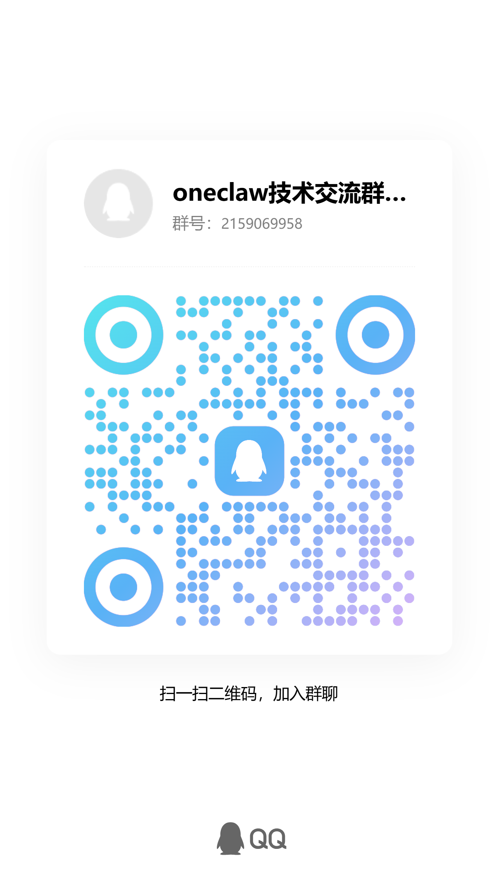
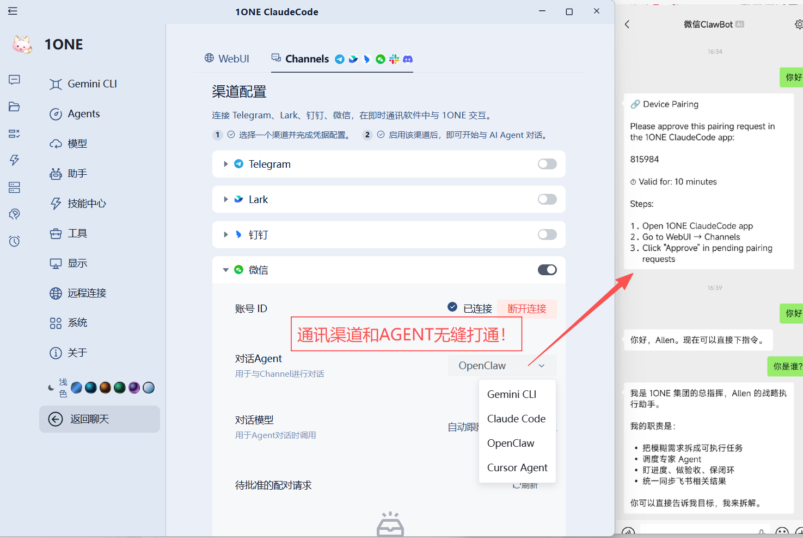
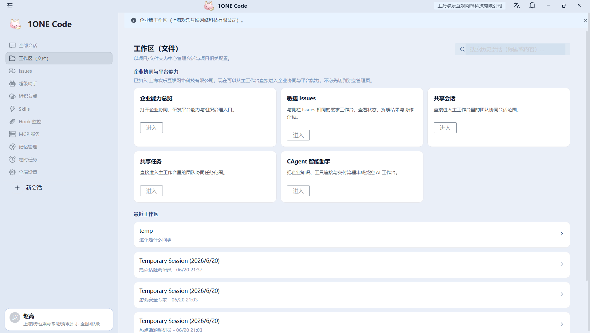
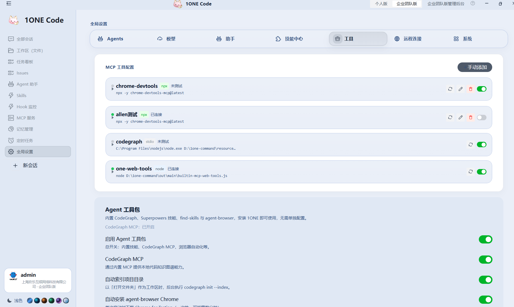
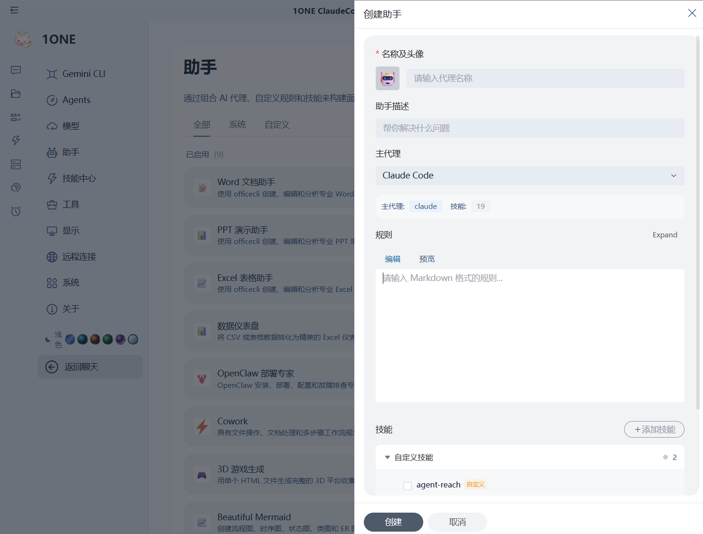
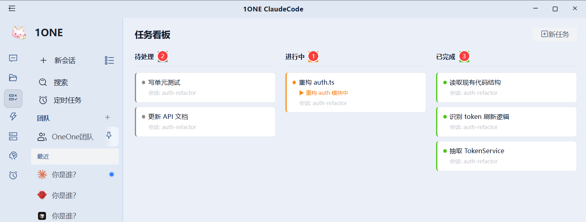
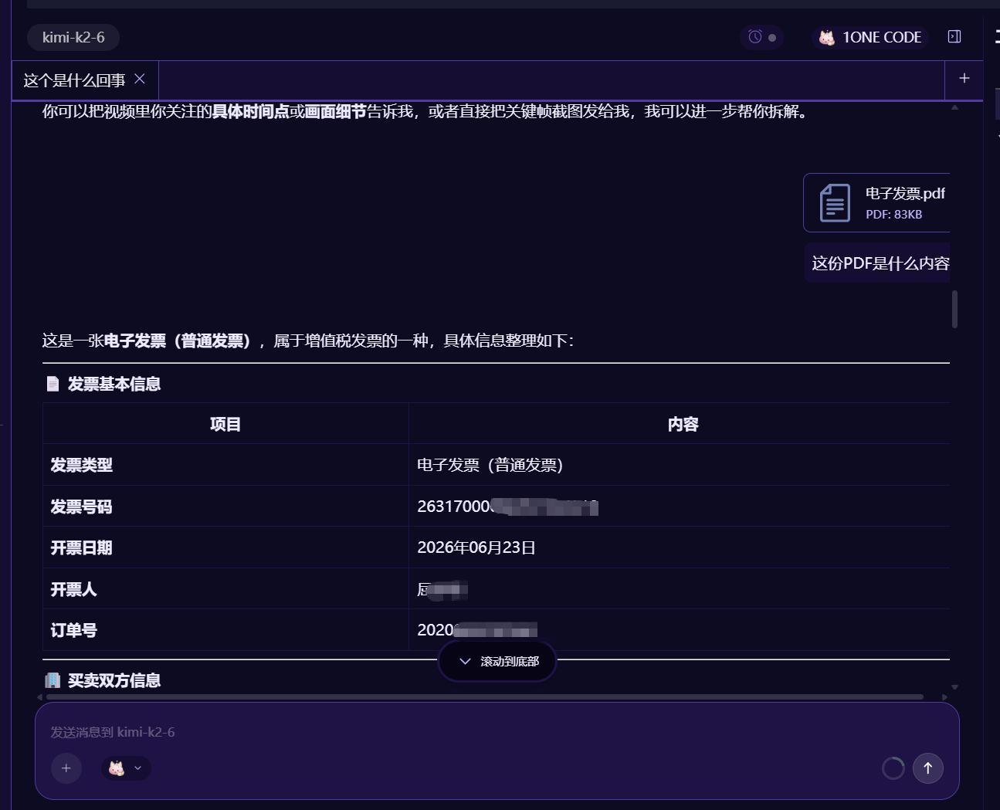
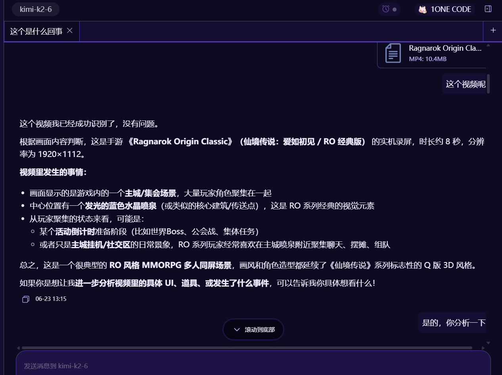

# 1One WORK — 你的 AI 全能工作站

> 🚀 版本：**v1.23.22** | 一句话唤起，万物皆可造
>
> 👤 作者：老赵 | ✨ 欢乐的同学必须第一批用上！

---

## 你能用 1One WORK 做什么？

| # | 愿望 | 实现方式 |
|---|------|----------|
| 1 | 🎮 一句话做一个小游戏 | 输入想法 → 3D 游戏自动生成 |
| 2 | 📖 一句话创作故事和角色 | 描述世界观 → 完整剧情线+角色卡 |
| 3 | 📊 一句话做一份牛逼的 PPT | 说主题 → 专业 PPT 一键导出 |
| 4 | 💻 不会代码也能写软件 | 说需求 → AI 自动编码 |
| 5 | 📱 下班用微信飞书管 AI | 手机聊天 → 远程控制 AI 工作 |
| 6 | 👥 多个人合作开发 | 团队版工作区 → 共享 AI 会话 |
| 7 | 🇨🇳 中文界面顺手 | 全中文图形化 → 告别英文命令行 |
| 8 | 🧰 管理 N 个开发工具 | 可视化 MCP 中心 → 统一管控 |

---

## 一、功能亮点

### 🎮 1. 一句话做一个游戏

输入一句话，AI 自动生成完整的 3D 游戏。无需建模、无需编程、无需游戏引擎知识。

- **3D 游戏生成**：内置 `game-3d` 助手，输入「做一个太空射击游戏」即可生成可运行的游戏
- **游戏策划**：`story-roleplay` 助手帮你设计世界观、角色、剧情分支
- **Mermaid 可视化**：自动生成游戏架构图、流程图

| 游戏生成过程 |
|:---:|
|  |
|  |
|  |

---

### 📖 2. 一句话创作一个故事背景和角色

- **故事角色扮演**：`story-roleplay` 助手，从世界观到角色卡到剧情线，一句话搞定
- **学术论文辅助**：`academic-paper` 助手，帮你写论文、润色、排版
- **Mermaid 图表**：自动生成思维导图、时间线、人物关系图

| 故事创作 | 角色设计 |
|:---:|:---:|
|  |  |

---

### 📊 3. 一句话做一份专业的 PPT

内置 **5 大 PPT/Office 助手**：

| 助手 | 职责 | 输出格式 |
|------|------|----------|
| `ppt-creator` | 标准商务 PPT | `.pptx` |
| `morph-ppt` | 风格化创意 PPT | `.pptx` |
| `morph-ppt-3d` | 3D 风格 PPT | `.pptx` |
| `pitch-deck-creator` | 投资人路演 Deck | `.pptx` |
| `excel-creator` | 数据表格 | `.xlsx` |
| `word-creator` | 文档排版 | `.docx` |

一键导出原生 Office 格式，兼容 **WPS** 和 **Microsoft Office**，随手就能用。

| 一句话做 PPT |
|:---:|
|  |

---

### 💻 4. 不会代码也能写自己的软件

描述你想要的功能，AI 自动生成完整软件：

- **UI/UX 设计**：`ui-ux-pro-max` 助手，描述界面样子 → 自动生成前端代码
- **Office 工具链**：`officecli-*` 系列技能覆盖 docx / xlsx / pptx / word-form / financial-model / data-dashboard / academic-paper / pitch-deck
- **一键部署**：`1one-webui-setup` 技能，可视化配置 WebUI 服务端
- **内置 MCP 服务**：图片生成、PDF 导出、Web 搜索工具，零配置使用
- **执行本地操作**：AI 可以直接操作你的电脑，自动化完成重复任务

| 一句话完成开发任务 | 执行本地操作 |
|:---:|:---:|
|  |  |

---

### 📱 5. 下班后还能用微信和飞书管理 AI

**多渠道机器人支持**，下班后手机也能管：

| 渠道 | 功能 | 适用场景 |
|------|------|----------|
|  **微信（个人微信）** | 聊天、任务、文件传输、AI 对话 | 个人日常 |
|  **飞书 / Lark** | 企业内部集成、审批、消息推送 | 企业办公 |
| **钉钉** | 企业办公自动化 | 企业办公 |
| **Telegram** | 跨国团队即时通讯 | 海外团队 |

> 💡 **原理**：每个渠道都是一个独立插件 (`src/process/channels/plugins/`)，可热插拔、热加载、独立启停。

| 微信机器人 | 通讯渠道管理 | 渠道控制面板 |
|:---:|:---:|:---:|
|  |  |  |

---

### 👥 6. 团队协作开发

**企业团队版工作区** + **管理后台**，让团队共享 AI 能力：

| 功能 | 说明 |
|------|------|
| **团队会话** | 多人共享一个 AI 会话，共同编辑和调试 |
| **团队需求面板** | 需求分发、任务跟踪、进度管理 |
| **团队代码仓库** | 代码共享、版本管理、协同开发 |
| **超级助手** | 团队级 AI 助手，统一配置、统一调度 |
| **技能下发** | 管理员统一推送 AI 技能到成员 |
| **管理后台** | LDAP / 飞书 / 钉钉认证、成员管理、邀请码、邮件 |
| **权限控制** | 个人版 ↔ 企业团队版一键切换，数据完全隔离 |
| **扩展市场** | Extension Hub，发布和共享自定义扩展 |

| 团队工作区 | 需求面板 | 团队任务 |
|:---:|:---:|:---:|
|  |  |  |

| 超级助手 | 技能下发 | 代码仓库 |
|:---:|:---:|:---:|
|  |  |  |

| 能力展示 | 后台功能预览 |
|:---:|:---:|
|  |  |

| 管理员后台 |
|:---:|
|  |

---

### 🇨🇳 7. CLAUDE CODE 的 UI 中国人友好

告别英文终端，**全中文图形化界面**：

| 特性 | 说明 |
|------|------|
| **全中文界面** | 原生简体中文，所有菜单、设置、提示均为中文 |
| **图形化操作** | 左侧导航栏，标签页管理，鼠标就能操作 |
| **可视化设置** | 模型配置、MCP 服务器、Agent 预设全部可视化 |
| **WebUI 浏览器** | `localhost:25809` 网页访问，手机平板都能用 |
| **跨平台** | Windows + macOS 双平台 |
| **工作空间** | 多任务分屏管理 |
| **历史会话** | 搜索、回顾、继续上一次对话 |

| 工作空间 | WebUI 网页版 |
|:---:|:---:|
|  |  |

| 全局设置 | 历史会话 | 历史搜索 |
|:---:|:---:|:---:|
|  |  |  |

| 会话中改模型 | 开机启动 & 多语言 |
|:---:|:---:|
|  |  |

---

### 🧰 8. N 个开发工具统一管理

**内置 MCP（Model Context Protocol）工具中心**，所有工具统一管理：

| 内置 MCP | 功能 |
|----------|------|
| `webToolsServer` | 网页搜索、抓取、内容分析 |
| `imageGenServer` | AI 图片生成 |
| `exportToPdfServer` | 文档导出为 PDF |
| 用户自定义 MCP | 连接自己的数据库、API、CLI 工具 |

> ⚡ **内置 aionrs 引擎 v0.1.38**：Agent 响应更快、推理更稳定

| MCP 服务管理 | MCP 监控 | 一键添加 MCP | 工具面板 |
|:---:|:---:|:---:|:---:|
|  |  |  |  |

---

## 二、全场景专家团队（OCP 一人公司）

> **召唤你的 AI 专家团**，覆盖运营、设计、财务、法务、开发等核心岗位，多专家并行协作，从策略到交付全程自主完成。

### 团队 Agent 模式

- **多智能体并行**：多个 Agent 同时工作，互为补充
- **任务自动分解**：复杂任务自动 → 子任务 → 分配给对应专家
- **结果自动汇总**：各专家输出统一汇总到工作区

### 🤖 内置助手一览（19 个，开箱即用）

| 助手 | 角色 | 一句话描述 |
|------|------|------------|
| `ppt-creator` | 🎨 PPT 设计师 | 快速生成标准商务演示 |
| `morph-ppt` | ✨ 创意设计师 | 风格化 PPT，拒绝模板 |
| `morph-ppt-3d` | 🏗️ 3D 设计师 | 3D 风格 PPT 生成 |
| `pitch-deck-creator` | 💰 投资人关系 | 路演 Deck，打动投资人 |
| `excel-creator` | 📊 数据分析师 | 表格制作、数据可视化 |
| `word-creator` | 📝 文档专员 | 文档排版、格式美化 |
| `game-3d` | 🎮 游戏程序员 | 3D 游戏开发 |
| `story-roleplay` | 📖 编剧 | 故事创作、角色设计、世界观 |
| `academic-paper` | 🎓 学术编辑 | 论文写作、润色、排版 |
| `ui-ux-pro-max` | 🖌️ UI/UX 设计师 | 界面设计、原型、前端代码 |
| `financial-model-creator` | 💹 财务分析师 | 财务模型、预算规划 |
| `dashboard-creator` | 📈 仪表盘设计师 | 数据看板、BI 报表 |
| `beautiful-mermaid` | 🔗 图表设计师 | Mermaid 流程图、架构图 |
| `star-office-helper` | ⭐ 全能助理 | 日常办公杂事 |
| `human-3-coach` | 🧘 人生教练 | 咨询、规划、成长 |
| `openclaw-setup` | 🛠️ DevOps 工程师 | 环境配置、部署 |
| `cowork` | 🤝 协作者 | 多人协作、任务跟进 |
| `planning-with-files` | 📋 项目经理 | 文件驱动的项目规划 |
| `social-job-publisher` | 🔍 招聘专员 | 社交招聘发布 |
| `moltbook` | 📓 笔记助手 | 知识管理、整理归档 |

| 助手面板 | 内置大量助手 | AGENT 搭配 | 创建个人智能体 |
|:---:|:---:|:---:|:---:|
|  |  |  |  |

---

## 三、更多强大功能

### 🧩 技能仓库

内置丰富的 AI 技能库，即装即用，覆盖各种业务场景。

**🎯 斜杠命令调用**：在聊天框直接输入 `/skill-name` 即可唤起对应技能，无需翻菜单、无需额外操作。技能即命令，随手就用。

| 技能仓库 | 技能列表 |
|:---:|:---:|
|  |  |

### 🧠 记忆管理

AI **长期记忆**，跨会话持久化。你用过的东西、聊过的内容 AI 都记得，越用越懂你。

| 记忆概览 | 记忆管理 |
|:---:|:---:|
|  |  |

### ⏰ 定时任务

设定定时任务，AI 自动在指定时间执行。白天写代码，晚上自动跑任务，**下班也能跑**。

| 定时任务 | 定时任务配置 |
|:---:|:---:|
|  |  |

### 📋 任务看板

可视化任务管理，**进度一目了然**，拖拽即可调整优先级。



### 🌐 远程访问

支持远程访问设置，**跨网络使用**。出差、在家都能连上你的 AI 工作站。

| 远程访问 | 远程访问设置 |
|:---:|:---:|
|  |  |

### 🔗 HOOK 监控

**事件驱动**的自动化触发，灵活编排工作流。文件变更、消息到达、定时触发，一切皆可自动化。


### 📄 PDF & 视频解读

支持 PDF 文档解读和视频内容分析。上传文件，AI 自动提取、总结、翻译。

| PDF 解读 | 视频解读 |
|:---:|:---:|
|  |  |

### 🎛️ 模型管理

支持多模型统一管理，**一键切换**。Claude、GPT、Gemini、DeepSeek 等主流模型随意换。

| 模型管理 |
|:---:|
|  |

---

## 四、怎么下载和安装

### 4.1 安装包（推荐非技术同学）

> 🔧 **内部的 litellm 地址默认是**：`https://litellm-internal.123u.com`

**个人单机版**：

| 平台 | 安装方式 |
|------|----------|
| 🪟 **Windows** | 运行 `1One-ClaudeCode-Setup-{version}.exe`，下一步 → 完成 |
| 🍎 **macOS** | 打开 `.dmg` 文件，拖到 Applications 文件夹 |

**企业团队版（推荐）**：

联系管理员获取邀请码和部署文档。

| 企业版后台登录 | 上帝视角 |
|:---:|:---:|
|  |  |

### 4.2 GIT 源码安装（推荐技术同学，保证代码最新）

```bash
# 克隆仓库
git clone https://github.com/gaogg521/1ONE-ClaudeCode.git
cd 1ONE-ClaudeCode

# 安装依赖
npm install

# 开发模式（热更新 HMR）
npm run restart

# WebUI 模式（浏览器访问，无桌面窗口）
npm run restart:webui

# 构建 Windows 安装包
npm run dist:win
```

**环境要求**：

```bash
where.exe node        # Node.js >= 18
where.exe npx         # npx 随 Node 一起安装
node -v               # 推荐 v22.21.1+
npx -v
claude --version      # Claude Code CLI
```

> **MAC 客户端安装包**：请查看飞书文档最上面的下载链接

---

## 五、版本对比

| 功能 | 🌟 个人版 | 🏢 企业团队版 |
|------|:--------:|:------------:|
| 本地聊天 | ✅ | ✅ |
| 内置助手（19 个） | ✅ | ✅ |
| 斜杠命令调用技能 | ✅ | ✅ |
| MCP 工具中心 | ✅ | ✅ |
| WebUI 浏览器访问 | ✅ | ✅ |
| 模型管理 | ✅ | ✅ |
| 定时任务 | ✅ | ✅ |
| 记忆管理 | ✅ | ✅ |
| 微信/飞书/钉钉机器人 | ✅ | ✅ |
| 团队协作 | ❌ | ✅ |
| LDAP/SSO 认证 | ❌ | ✅ |
| 管理后台 | ❌ | ✅ |
| 邀请码管理 | ❌ | ✅ |
| 扩展市场（Extension Hub） | ❌ | ✅ |
| 技能统一下发 | ❌ | ✅ |

---

## 六、技术架构一览

```
┌──────────────────────────────────────────────────────────────┐
│                     🖥️  1One WORK（桌面端）                      │
├───────────────┬───────────────────────┬──────────────────────┤
│   主进程        │       渲染进程          │      Worker 池        │
│   Electron     │   React + HashRouter   │   gemini / acp       │
│   IPC Bridge   │   Arco Design UI       │   aionrs v0.1.38     │
│   Express 服务  │   中文可视化界面         │   nanobot / openclaw │
│   SQLite 存储   │   WebUI 操作面板        │   远程 Agent          │
├───────────────┴───────────────────────┴──────────────────────┤
│                    📡 渠道插件（Channels）                       │
│        WeChat 微信    │   Lark 飞书    │   Dingtalk 钉钉       │
├──────────────────────────────────────────────────────────────┤
│                    🔧 内置 MCP 服务                              │
│      Web 搜索    │    图片生成    │    PDF 导出    │  自定义 MCP  │
├──────────────────────────────────────────────────────────────┤
│                    ⚡ Claude Code CLI 引擎                       │
└──────────────────────────────────────────────────────────────┘
```

---

## 七、常见问题

### ❓ Q：1One WORK 与 Claude Code 是什么关系？

> **A：** 1One WORK 是 Claude Code 的**可视化控制中心**。保留了 Claude Code 的全部核心能力，同时提供了：
> - 🖥️ 图形化界面（告别命令行）
> - 🇨🇳 全中文环境
> - 🧩 19 个内置开箱即用助手
> - 📱 微信 / 飞书 / 钉钉机器人
> - 👥 企业团队协作

### ❓ Q：支持哪些大模型？

> **A：** 通过 litellm 网关支持几乎所有主流模型：
> - **Anthropic**：Claude Opus 4.8 / Sonnet 5 / Haiku 4.5
> - **OpenAI**：GPT-4o / GPT-4o-mini
> - **Google**：Gemini / Gemini Flash
> - **DeepSeek**：DeepSeek-V3 / DeepSeek-R1
> - 以及更多开源模型...

### ❓ Q：数据安全吗？

> **A：** 🛡️ 数据**完全在本地**：
> - 本地 SQLite 存储：`%APPDATA%\1OneClaudeCode-Dev\1one\1one.db`
> - 数据不上传、不泄露、不共享
> - 企业版支持 **LDAP/SSO 认证**，企业数据隔离

### ❓ Q：能在手机上用吗？

> **A：** ✅ **可以！** 三种方式：
> 1. **WebUI 模式**：`npm run restart:webui` 启动，局域网内手机浏览器访问
> 2. **微信机器人**：手机微信直接聊天控制
> 3. **飞书/钉钉**：手机端企业聊天工具控制

### ❓ Q：团队版和个人版的区别？

> **A：** 界面完全一样，区别在于：
> - **个人版**：用自己的本地身份，数据在本机
> - **企业团队版**：用公司身份，数据在企业租户下，支持 LDAP / 飞书认证、团队会话、管理后台
> - **切换版本不会打开管理后台**（管理后台在侧栏独立入口）

---

## 八、交流与支持

- **GitHub**：[https://github.com/gaogg521/1ONE-ClaudeCode](https://github.com/gaogg521/1ONE-ClaudeCode)
- **遇到问题？** 在 GitHub 提 Issue
- **企业部署？** 联系管理员获取邀请码

---

> 🎉 **1One WORK — 你的 AI 全能工作站，现在就上车！**
