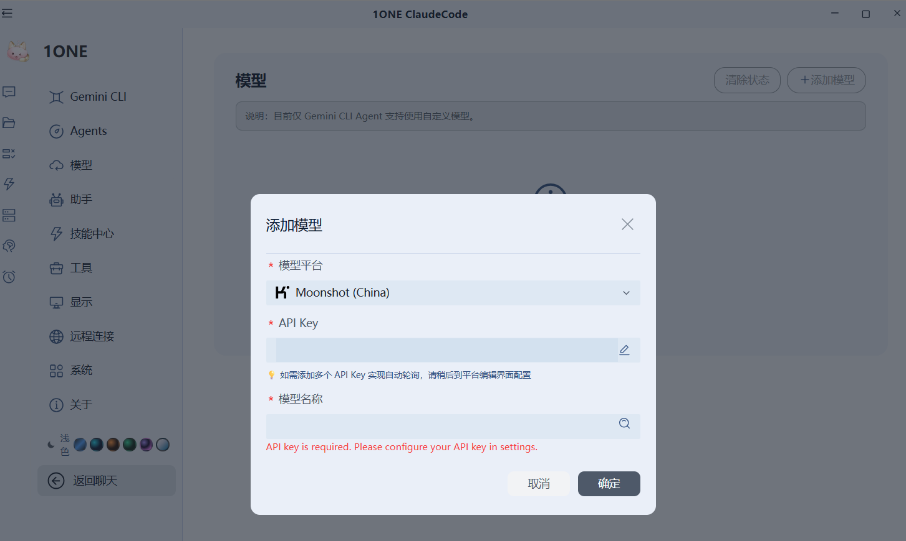
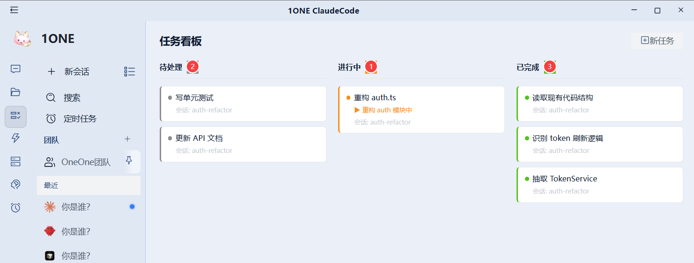
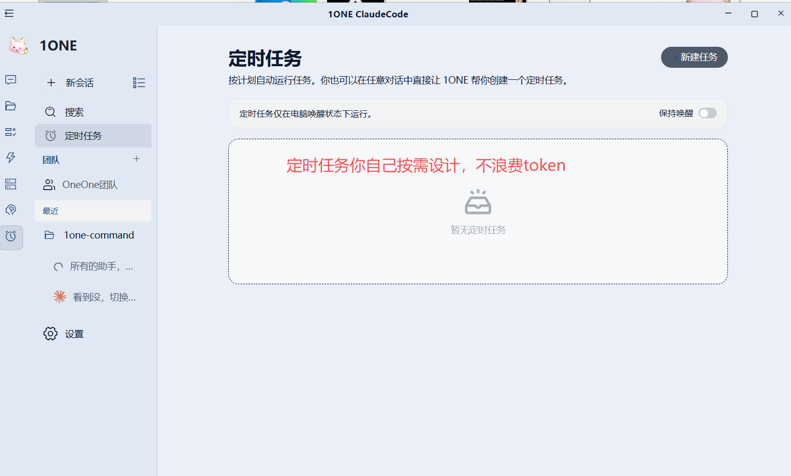
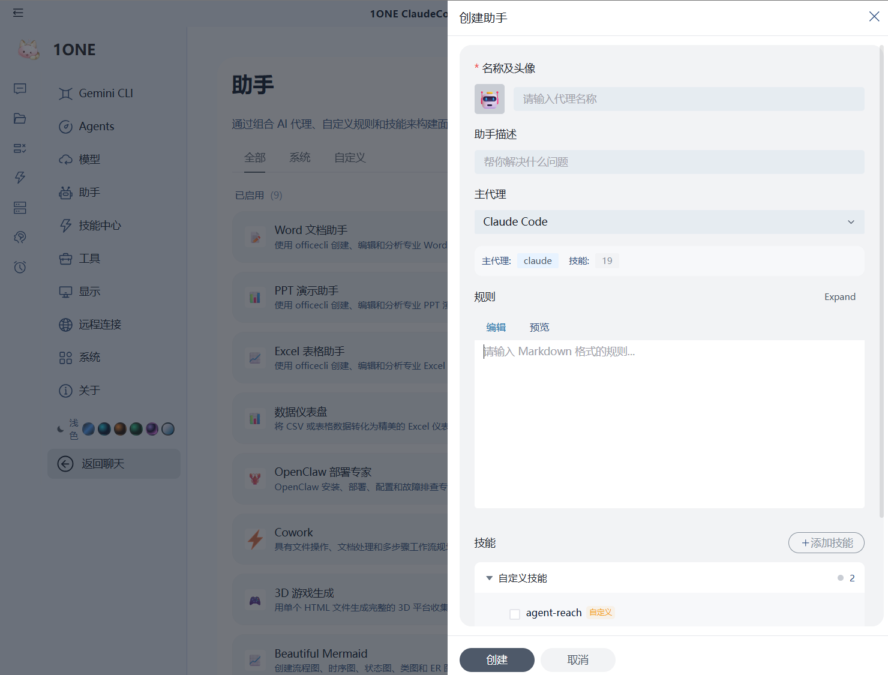
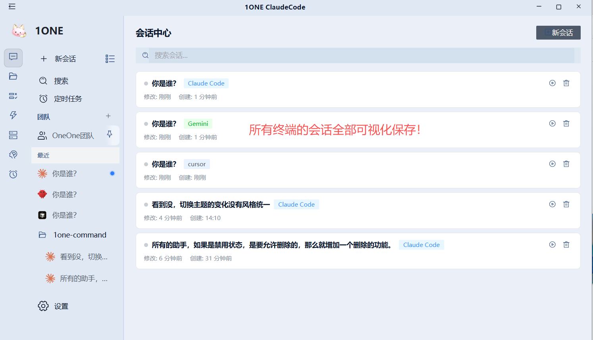
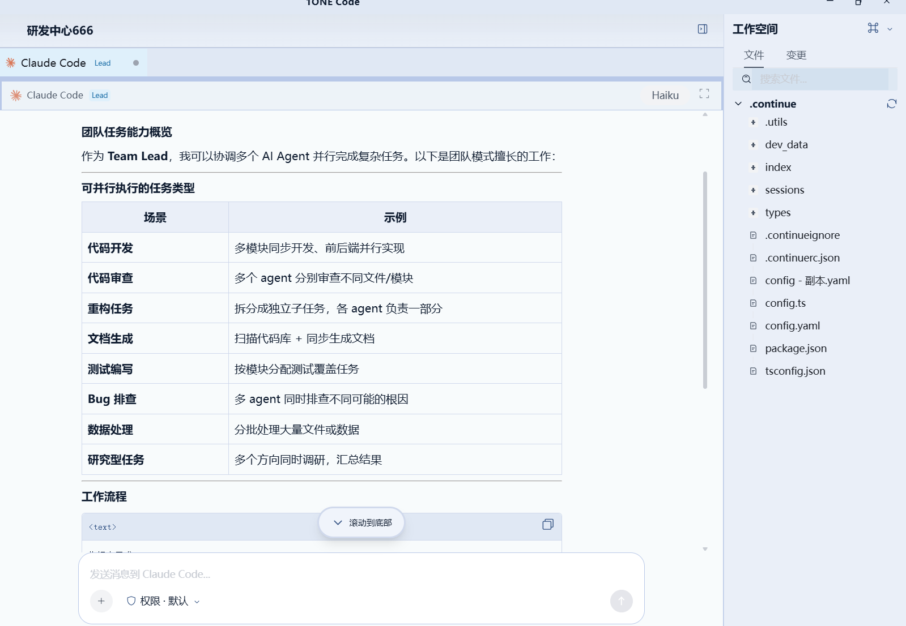
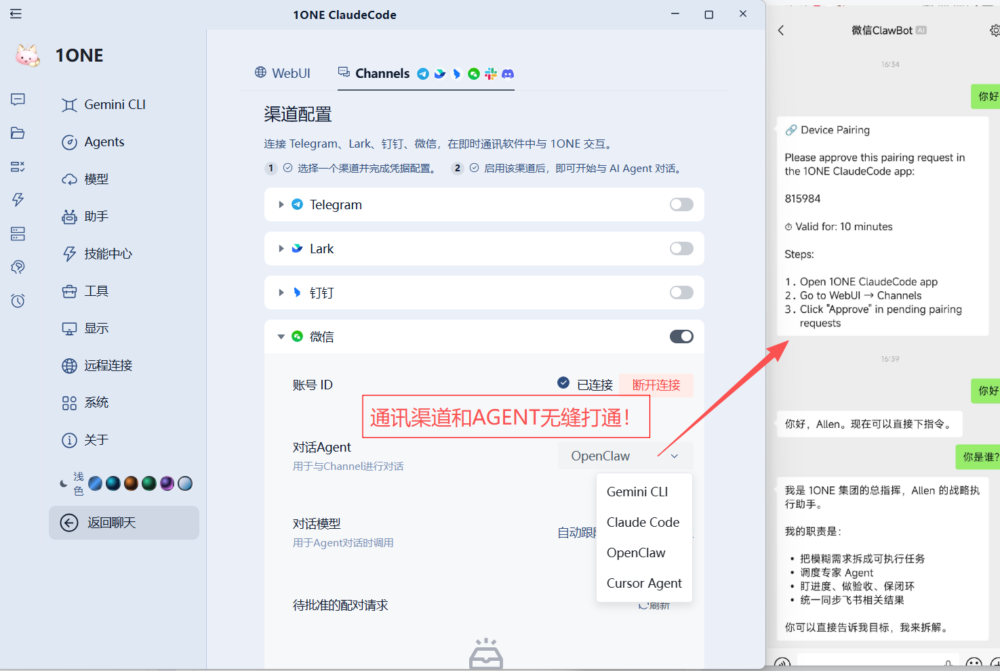
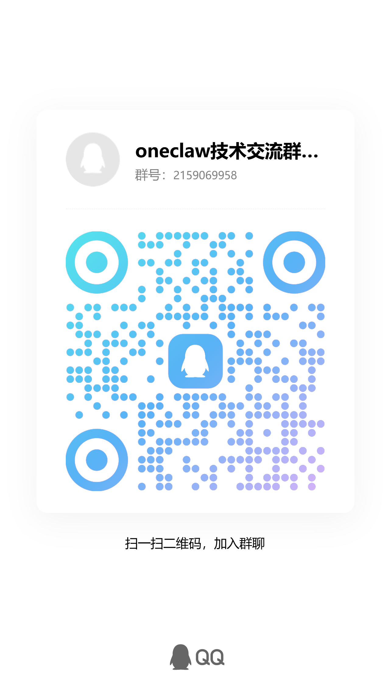

<p align="center">
  
</p>

<h1 align="center">1ONE ClaudeCode</h1>

<p align="center">
  <strong>Claude Code 可视化控制面板 · AI Agent 协作指挥台</strong><br>
  <em>免费开源 · 零门槛上手 · 支持任意模型 · 多 Agent 协作 · 远程访问 · 24/7 自动化</em>
</p>

<p align="center">
  
  &nbsp;
  
  &nbsp;
  
  &nbsp;
  
  &nbsp;
  
</p>

<p align="center">
  <a href="https://github.com/gaogg521/1ONE-Claude-Code/releases">
    
  </a>
  &nbsp;&nbsp;
  <a href="https://github.com/gaogg521/gaogg521-openclaw-Visual-Control-Panel">
    
  </a>
</p>

---

## 📋 目录

- [✨ 功能概览](#-功能概览)
- [🖥️ 界面预览](#️-界面预览)
  - [统一入口](#1-统一入口--所有-agent-一网打尽)
  - [多 Agent 管理](#2-多-agent-管理--自由搭配组合)
  - [模型自由配置](#3-模型自由配置--支持任意-api)
  - [任务看板](#4-任务看板--可视化任务管理)
  - [Hook 监控](#5-hook-监控--自动化事件驱动)
  - [MCP 服务管理](#6-mcp-服务管理--协议一站托管)
  - [三重记忆架构](#7-三重记忆架构--上下文永不丢失)
  - [定时任务](#8-定时任务--无需-token-的自动化)
  - [技能市场](#9-技能市场--一键装载专业能力)
  - [自定义助手](#10-自定义助手--打造专属-ai-专家)
  - [会话中心](#11-会话中心--全量历史可视化保存)
  - [团队协作模式](#12-团队协作模式--多-agent-并行作战)
  - [远程访问 WebUI](#13-远程访问-webui--随时随地掌控)
  - [通讯渠道控制](#14-通讯渠道控制--im-直连-agent)
- [🚀 快速开始](#-快速开始)
- [🛠️ 技术栈](#️-技术栈)
- [🤝 参与贡献](#-参与贡献)
- [📬 联系作者](#-联系作者)

---

## ✨ 功能概览

| 功能模块 | 说明 |
|---|---|
| 🤖 **多 Agent 统一入口** | Claude Code、OpenClaw、Gemini CLI、Cursor Agent 等，一个界面全部管理 |
| 🔧 **自由配置模型** | 支持 OpenAI、Anthropic、Gemini、国内模型等任意 API，一键添加 |
| 📋 **可视化任务看板** | 待处理 / 进行中 / 已完成三栏看板，直观追踪 AI 任务进度 |
| ⚡ **Hook 事件监控** | 拦截 Claude Code 生命周期事件，接入任意自动化脚本 |
| 🔌 **MCP 服务管理** | 图形化管理所有 MCP 服务连接状态、工具列表、全局/项目范围 |
| 🧠 **三重记忆架构** | MEMORY.md / CLAUDE.md / 项目级记忆，上下文跨会话永久保持 |
| ⏰ **定时任务** | Cron 驱动的无人值守自动化，无需消耗额外 Token |
| 🛍️ **技能市场** | 全球 Agent 技能一键安装，扩展 AI 专业能力 |
| 👤 **自定义助手** | 创建专属 AI 角色、绑定技能、设置提示词，打造私有专家 |
| 💬 **会话中心** | 所有历史会话完整保存，跨项目检索回溯 |
| 👥 **团队协作模式** | 多 Agent 并行分工，突破单会话上限处理大型复杂任务 |
| 🌐 **远程 WebUI 访问** | 局域网/内网穿透远程访问，手机扫码直接使用 |
| 💬 **通讯渠道控制** | Telegram、飞书、钉钉、微信直连 Agent，扫码配对即用 |
| 🎨 **6套主题** | 赛博蓝/熔岩橙/深林绿/极光紫/月光银/暗夜默认，冷暖协调 |

---

## 🖥️ 界面预览

### 1. 统一入口 · 所有 Agent 一网打尽

> 一个入口管理所有 AI Agent。无论是 Claude Code、OpenClaw 还是 Gemini，统一调度，自由切换模型，不需要到处跑终端。

<p align="center">
  
</p>

---

### 2. 多 Agent 管理 · 自由搭配组合

> 内置支持 **Gemini CLI、Claude Code、OpenClaw、Cursor Agent** 等主流 Agent，可独立配置、灵活启用，满足不同场景需求。

<p align="center">
  
</p>

---

### 3. 模型自由配置 · 支持任意 API

> 图形化添加模型，无需手动编辑配置文件。支持 OpenAI、Anthropic、Moonshot、Gemini 等国内外所有主流模型，填入 API Key 即用。

<p align="center">
  
</p>

---

### 4. 任务看板 · 可视化任务管理

> 将 AI 正在执行的所有任务用 **Kanban 看板**直观展示。待处理、进行中、已完成一目了然，大型项目多任务并行不再混乱。

<p align="center">
  
</p>

---

### 5. Hook 监控 · 自动化事件驱动

> 深度集成 Claude Code 生命周期 Hook 系统。`PreToolUse`、`PostToolUse`、`SessionEnd`、`TaskCompleted` 等事件均可绑定自定义脚本，实现飞书通知、日志记录、自动推送等自动化流程。

<p align="center">
  
</p>

---

### 6. MCP 服务管理 · 协议一站托管

> 图形化管理所有 MCP（Model Context Protocol）服务。支持 STDIO / HTTP 两种传输方式，实时显示连接状态、可用工具数量，全局或项目级范围灵活配置。

<p align="center">
  
</p>

---

### 7. 三重记忆架构 · 上下文永不丢失

> 独创**三重记忆体系**：全局 MEMORY.md、项目级 CLAUDE.md、会话级上下文，三层隔离互补。AI 记得你是谁、记得你的项目偏好，无需每次重新说明。

<p align="center">
  
</p>

---

### 8. 定时任务 · 无需 Token 的自动化

> 基于 **Cron 表达式**设置定时任务，让 AI Agent 在无人值守状态下自动运行。支持指定执行 Agent、新建/持续会话模式、自定义执行指令，实现真正的 24/7 自动化。

<p align="center">
  
</p>

<p align="center">
  
</p>

---

### 9. 技能市场 · 一键装载专业能力

> 内置**技能市场**，提供来自社区的全球 Agent 技能包。agent-reach、find-skills、mermaid、moltbook 等专业技能一键安装，即刻赋予 AI 新的专业能力。

<p align="center">
  
</p>

---

### 10. 自定义助手 · 打造专属 AI 专家

> 自由创建**私有 AI 助手**：设定名称、头像、提示词、绑定技能、指定底层模型。PPT 生成专家、代码审查专家、数据分析师……让每个助手都成为垂直领域的顶尖专家。

<p align="center">
  
</p>

---

### 11. 会话中心 · 全量历史可视化保存

> 所有 AI 对话**完整持久化保存**，跨项目统一管理。支持全文搜索、分组浏览，随时回溯任意历史会话的完整上下文，再也不怕找不到之前的对话。

<p align="center">
  
</p>

---

### 12. 团队协作模式 · 多 Agent 并行作战

> **1ONE Team 模式**支持多个 Agent 同时在线、并行分工。研究员、开发者、测试员各司其职，突破单会话上下文限制，轻松驾驭大型复杂项目。

<p align="center">
  
</p>

---

### 13. 远程访问 WebUI · 随时随地掌控

> 开启 **WebUI 模式**后，局域网内任意设备均可通过浏览器访问。支持内网穿透远程部署，扫描二维码即可在手机/平板上直接使用，随时随地掌控你的 AI 工作流。

<p align="center">
  
</p>

---

### 14. 通讯渠道控制 · IM 直连 Agent

> 支持将 **Telegram、Lark（飞书）、钉钉、微信**等主流 IM 工具直接与 AI Agent 打通。扫码完成设备配对后，无需打开桌面客户端，直接在聊天软件里向 Agent 下达指令、接收任务结果，真正实现随时随地的 AI 协作。

<p align="center">
  
</p>

---

## 🚀 快速开始

### 方式一：下载安装包（推荐）

前往 [Releases 页面](https://github.com/gaogg521/1ONE-Claude-Code/releases) 下载对应系统的安装包：

| 系统 | 文件格式 |
|---|---|
| Windows | `.exe` 安装包 / `.zip` 便携版 |
| macOS | `.dmg` 安装包 |
| Linux | `.deb` 安装包 |

### 方式二：源码运行（开发者）

**环境要求：** Node.js >= 22、Git

```bash
# 克隆项目
git clone https://github.com/gaogg521/1ONE-Claude-Code.git
cd 1ONE-Claude-Code

# 安装依赖
npm install

# 启动开发模式
npm run start

# 关闭并清理锁文件后重启
npm run restart
```

### 第一次使用

1. 启动应用后，点击左侧 **Agents** 选择你要使用的 AI Agent
2. 进入**模型**设置，添加你的 API Key
3. 回到首页，开始与 AI 对话

---

## 🛠️ 技术栈

| 层级 | 技术 |
|---|---|
| **桌面壳** | Electron 30+ |
| **前端框架** | Vue 3 + TypeScript |
| **构建工具** | Vite + electron-vite |
| **UI 组件** | Arco Design + UnoCSS |
| **终端集成** | node-pty + xterm.js |
| **本地存储** | SQLite (better-sqlite3) |
| **运行时** | Bun |
| **协议支持** | MCP (Model Context Protocol) |

---

## 🤝 参与贡献

欢迎提交 Issue 和 Pull Request！

- 🐛 **Bug 反馈**：[提交 Issue](https://github.com/gaogg521/gaogg521-openclaw-Visual-Control-Panel/issues)
- 💡 **功能建议**：[发起讨论](https://github.com/gaogg521/gaogg521-openclaw-Visual-Control-Panel/issues)
- 📖 **文档完善**：[查看文档仓库](https://github.com/gaogg521/gaogg521-openclaw-Visual-Control-Panel)

---

## 📬 联系作者

有问题、想交流、或者想一起共建？欢迎通过以下方式联系：

<table align="center">
  <tr>
    <td align="center" width="300">
      <strong>💬 QQ 技术交流群</strong><br>
      <sub>oneclaw技术交流群 · 群号：2159069958</sub><br><br>
      
      <br><sub>扫码加入，与开发者和用户直接交流</sub>
    </td>
    <td align="center" width="50"></td>
    <td align="center" width="300">
      <strong>💚 微信</strong><br>
      <sub>Allen.赵 · 上海浦东</sub><br><br>
      
      <br><sub>扫码添加微信，问题反馈 / 交流合作</sub>
    </td>
  </tr>
</table>

---

<p align="center">
  <sub>Built with ❤️ by <a href="https://github.com/gaogg521">gaogg521</a> · Licensed under Apache-2.0</sub>
</p>
