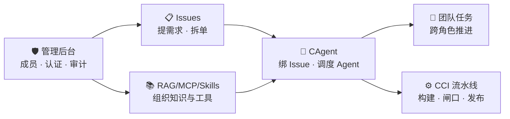
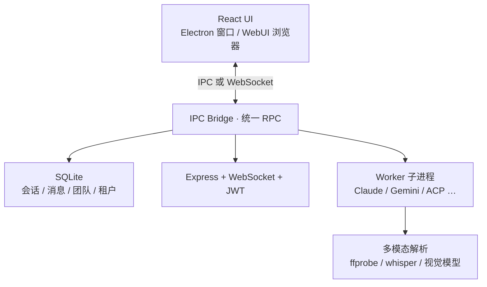

<h1 align="center">1ONE ClaudeCode</h1>

<p align="center">
  
</p>

<p align="center">
  <strong>开源 · 多 Agent · 多模态 · 可远程 · 可协同 · 可私有化的 AI 操作系统</strong><br>
  <em>一个人用是创作引擎，一个团队用是交付平台</em>
</p>

<p align="center">
  
  &nbsp;
  
  &nbsp;
  
  &nbsp;
  
  &nbsp;
  
</p>

<p align="center">
  <a href="https://github.com/gaogg521/1ONE-Claude-Code/releases">
    
  </a>
  &nbsp;&nbsp;
  <a href="https://1oneclaw.com/docs">
    
  </a>
</p>

---

## 这是什么

1ONE ClaudeCode 不是「又一个 AI 聊天工具」，也不是 Cursor 平替。它是一套 **Agent 操作系统**——把多 Agent 调度、多模态解析、远程访问、团队协作、DevOps 交付串进同一个产品。

**一句话区分**：
- Cursor 帮你写下一行代码
- Copilot 帮你补全一个函数
- **1ONE 帮你管一整支 AI 队伍，并把产出写进团队交付流程**

<p align="center">
  
</p>

---

## 和竞品比什么

| 对比维度 | **1ONE** | Cursor | Copilot | 原生 Claude Code |
|----------|:---:|:---:|:---:|:---:|
| 开源免费 | ✅ | 🔒 | 🔒 | 🔒 |
| 多 Agent 并存 | ✅ 原生 | ⚠️ 有限 | ⚠️ 弱 | ❌ 单一 |
| 多模态（图/视频/音频/PDF） | ✅ 全模态 | ⚠️ 仅图片 | ⚠️ 仅图片 | ⚠️ 有限 |
| 独立 WebUI + 手机访问 | ✅ | ❌ | ❌ | ❌ |
| IM 渠道（飞书/钉钉/微信） | ✅ | ❌ | ❌ | ❌ |
| 数字员工 + Cron 自动化 | ✅ | ❌ | ❌ | ⚠️ 有限 |
| Issues 需求协同 | ✅ 内置 | ❌ | ❌ | ❌ |
| 企业团队版（同 UI 切身份） | ✅ 免费 | 💰 Business | 💰 Enterprise | ⚠️ 弱 |
| DevOps（流水线/制品库/效能） | ✅ 内置 | ❌ | ❌ | ❌ |
| 私有化 / 内网部署 | ✅ | ❌ | ⚠️ 企业可选 | ⚠️ 大客户 |
| 月费 | **$0** | $20–40 | $10–19 | $20+ |

---

## 核心能力

### 🎬 多模态：让 Agent 看懂世界

不止「粘贴图片」——**图片、PDF、视频、音频全部转文字注入 Agent**，纯文本引擎也能处理多媒体。

| 模态 | 处理方式 |
|------|----------|
| 🖼️ 图片 | 多模态模型识别；非多模态模型走视觉模型兜底（Kimi Q2.6/Qwen-VL） |
| 📄 PDF | 文本抽取直注 Agent，替代卡死的 Chromium 预览 |
| 🎬 视频 | ffprobe 元数据 + 时长感知采样 ≤5 关键帧 + 逐帧描述 |
| 🔊 音频 | STT 三级回退：已配 provider → 对话/视觉模型网关 → whisper-1 |
| 💻 本地操作 | Agent 可整理桌面、移动文件、运行命令；YOLO 模式免确认 |

<p align="center">
  
</p>
<p align="center"><sub>视频解读：关键帧采样 + 逐帧描述，长视频精准问答</sub></p>

<p align="center">
  
</p>
<p align="center"><sub>PDF 解读：文本抽取直注 Agent</sub></p>

<p align="center">
  
</p>
<p align="center"><sub>Agent 执行本地操作：YOLO 模式 + 模糊匹配权限批准</sub></p>

### 🤖 多 Agent 指挥台

Claude Code / Codex / Gemini / OpenClaw / Cursor Agent **一个界面统管**，自动发现、一键切换。MCP/Skills 配一次全员复用。

<p align="center">
  
</p>
<p align="center"><sub>多 Agent 自由搭配，按任务选最合适的引擎</sub></p>

### 🌐 远程 + IM 触达

桌面、浏览器、手机、飞书/钉钉/微信 **同一套 Agent**。下班路上手机看进度，飞书发消息触发任务。

<p align="center">
  
</p>
<p align="center"><sub>浏览器打开即完整 UI</sub></p>

<p align="center">
  
</p>
<p align="center"><sub>手机 / 平板 / 同事电脑远程监管</sub></p>

<p align="center">
  
</p>
<p align="center"><sub>飞书 / 钉钉 / 微信触发 Agent 并回传</sub></p>

### ⏰ 数字员工 + Cron

创建智能体、绑技能、设定时、配文档交付模板（HTML/Word/飞书）。24/7 自动跑：日报、巡检、批处理无人值守。

<p align="center">
  
</p>
<p align="center"><sub>个人数字员工：选 Agent、绑技能、设定时、配置交付模板</sub></p>

<p align="center">
  
</p>
<p align="center"><sub>Cron 调度数字员工</sub></p>

### 🔧 MCP · Skills · 记忆 · Hook

- **MCP**：外部工具配一次、所有 Agent 共享
- **Skills**：按需安装社区技能，组织可统一下发
- **记忆**：全局 + 项目记忆，跨会话不断档
- **Hook**：生命周期事件可观测

<p align="center">
  
</p>
<p align="center"><sub>MCP 注册与启停</sub></p>

<p align="center">
  
</p>
<p align="center"><sub>技能市场</sub></p>

<p align="center">
  
</p>
<p align="center"><sub>记忆中心</sub></p>

<p align="center">
  
</p>
<p align="center"><sub>Hook 生命周期监控</sub></p>

### ✨ 一句话创作

不会代码也能产出可交付文件——游戏、PPT、文档、开发任务。

<p align="center">
  
</p>

<p align="center">
  
</p>

<p align="center">
  
</p>

---

## 三个使用场景

1ONE 用 **同一套 UI** 覆盖三种身份，标题栏一键切换，数据按租户隔离。

### 🧑 个人版：一个人就是一支 AI 军团

安装即用，无需加入企业。多 Agent + 多模态 + Cron + WebUI 远程，把 N 个工具收进一个指挥台。

### 🏢 企业团队版：把 AI 协作写进交付流程

已加入企业的成员用公司身份协同，界面与个人版完全相同，只换身份与数据边界。PM 提 Issue、研发用 Agent 处理、测试看流水线——全在一个产品里闭环。

**团队版在个人版基础上增加**：
- 企业身份登录（LDAP / 飞书 SSO / 企业账号，租户级数据隔离）
- 敏捷 Issues（需求看板、AI 智能拆单、协作评论）
- CAgent 智能助手（Issue 绑定 → 调度 Agent → 查看运行结果）
- 团队任务 & 共享会话（按团队 scope 协同）
- 团队 RAG 知识库 / MCP / Skills（组织统一下发，凭证集中管理）
- 团队代码库 / 运行时（纳入企业租户边界）

<p align="center">
  
</p>
<p align="center"><sub>企业团队版：同一工作台，公司身份下的 Issues、Agent 与协同</sub></p>

<p align="center">
  
</p>
<p align="center"><sub>CAgent：企业知识 + 工具连接 + 交付流程，围绕 Issue 调度 AI</sub></p>

<p align="center">
  
</p>
<p align="center"><sub>Issues 协同：状态、拆单结果、协作评论一屏掌握</sub></p>

<p align="center">
  
</p>
<p align="center"><sub>组织统一 Skills，一键下发到每位成员的 Agent</sub></p>

<p align="center">
  
</p>
<p align="center"><sub>工作区「企业协同与平台能力」：Issues / CAgent / 管理后台 / CCI 一键直达</sub></p>

### 🔄 团队协作闭环


```mermaid
flowchart LR
  A["📋 Issues<br/>提需求 · 拆单"] --> B["🤖 CAgent<br/>绑 Issue · 调度 Agent"]
  B --> C["👥 团队任务<br/>跨角色推进"]
  D["📚 RAG/MCP/Skills<br/>组织知识与工具"] --> B
  B --> E["⚙️ CCI 流水线<br/>构建 · 闸口 · 发布"]
  F["🛡️ 管理后台<br/>成员 · 认证 · 审计"] --> D
  F --> A
```

<p align="center">
  
</p>
<p align="center"><sub>任务看板：拖拽流转，Agent 与人协作推进</sub></p>

### 🛡️ 管理后台：组织治理 + DevOps，不另购 SaaS

组织管理员（`org_admin` / 系统管理员）的独立控制台。成员、LDAP/飞书、邀请码、RAG/MCP/Skills 治理、CTeam/CCI 流水线——商业 DevOps+AI 平台卖的能力，1ONE 开源内置。

<p align="center">
  
</p>
<p align="center"><sub>组织管理后台：成员、LDAP、飞书、邀请码、邮箱治理</sub></p>

<p align="center">
  
</p>
<p align="center"><sub>DevOps 平台：CTeam · CCI · CPack · CCode · CMeas 一站式</sub></p>

<p align="center">
  
</p>
<p align="center"><sub>企业 SSO 登录：本地账号 / LDAP / 飞书</sub></p>

> **关键设计**：切「企业团队版」不会打开管理后台；日常协作留在工作台，管组织才去后台。入口在左下角身份面板。

---

## 底层架构


```mermaid
flowchart TB
  UI["React UI<br/>Electron 窗口 / WebUI 浏览器"]
  Bridge["IPC Bridge · 统一 RPC"]
  DB["SQLite<br/>会话 / 消息 / 团队 / 租户"]
  WS["Express + WebSocket + JWT"]
  Workers["Worker 子进程<br/>Claude / Gemini / ACP …"]
  Media["多模态解析<br/>ffprobe / whisper / 视觉模型"]

  UI <-->|IPC 或 WebSocket| Bridge
  Bridge --> DB & WS & Workers
  Workers --> Media
```

- WebUI 与桌面 **复用同一套 Bridge**——不是两套代码
- 企业 API 按 **租户 scope** 隔离——个人数据不会混入组织池
- 多模态解析在 **Worker 侧**完成，结果以文字注入 Agent 上下文，UI 不卡

| 运行模式 | 命令 |
|----------|------|
| 桌面开发 | `npm run restart` |
| WebUI | `npm run webui:prod` |
| LAN 远程 | `npm run build:webui` 后访问 IP |
| 服务器部署 | [`docs/SERVER_DEPLOY_GUIDE.md`](./docs/SERVER_DEPLOY_GUIDE.md) |

---

## 更多截图

<p align="center">
  
</p>
<p align="center"><sub>任意 API 端点图形化配置</sub></p>

<p align="center">
  
</p>
<p align="center"><sub>对话中随时换模型</sub></p>

<p align="center">
  
</p>
<p align="center"><sub>数十个专业助手开箱即用</sub></p>

<p align="center">
  
</p>
<p align="center"><sub>助手中心：专业角色一键选用</sub></p>

<p align="center">
  
</p>
<p align="center"><sub>工具助手：封装工作流，降低 Prompt 门槛</sub></p>

<p align="center">
  
</p>
<p align="center"><sub>MCP 运行监控与排障</sub></p>

<p align="center">
  
</p>
<p align="center"><sub>一键接入；组织管理员可统一配团队 MCP</sub></p>

<p align="center">
  
</p>
<p align="center"><sub>技能仓库</sub></p>

<p align="center">
  
</p>
<p align="center"><sub>记忆可视化管理</sub></p>

<p align="center">
  
</p>
<p align="center"><sub>全量会话检索</sub></p>

<p align="center">
  
</p>
<p align="center"><sub>工作区分组 · 团队会话标识</sub></p>

<p align="center">
  
</p>
<p align="center"><sub>绑定会话 · 执行历史 · 启停</sub></p>

<p align="center">
  
</p>
<p align="center"><sub>多渠道统一管理</sub></p>

<p align="center">
  
</p>

<p align="center">
  
</p>

<p align="center">
  
</p>

<p align="center">
  
</p>

<p align="center">
  
</p>
<p align="center"><sub>Issue 详情：评论、关联任务、跳转 Agent 处理</sub></p>

<p align="center">
  
</p>
<p align="center"><sub>团队任务：跨角色看板</sub></p>

<p align="center">
  
</p>
<p align="center"><sub>企业代码资产接入</sub></p>

<p align="center">
  
</p>
<p align="center"><sub>系统管理员：创建企业、发邀请码、多租户治理</sub></p>

<p align="center">
  
</p>
<p align="center"><sub>端口、远程开关、企业加入、本地管理员</sub></p>

<p align="center">
  
</p>
<p align="center"><sub>Agent · 模型 · WebUI · 主题</sub></p>

<p align="center">
  
</p>
<p align="center"><sub>开机自启 · 多语言（中/英）</sub></p>

---

## 3 分钟上手

### 下载

[Releases](https://github.com/gaogg521/1ONE-Claude-Code/releases) → Windows `.exe` / macOS `.dmg` / Linux `.deb`

### 个人用户

1. **会话** → 选 Agent（推荐 1ONE CODE）
2. **设置 → 模型** → 填 API Key
3. 开聊；拖文件进对话框即可多模态问答
4. 想让 Agent 整理电脑？开 YOLO 模式，说"帮我整理桌面"

### 团队 / 企业

1. **设置 → WebUI** → 启用服务
2. **邀请码** 加入企业 → 标题栏切 **企业团队版**
3. **Issues / Agent 助手** 开始协同；管理员进 **管理后台**

### 开发者

```bash
git clone https://github.com/gaogg521/1ONE-Claude-Code.git && cd 1ONE-Claude-Code
npm install && npm run restart
```

---

## 打包发行版

### Windows

```bash
npm install && npm run dist:win
```
输出：`out/1ONE Code-{version}-win-x64.exe` 和 `.zip`

### macOS

```bash
npm install && npm run dist:mac
```
输出：`out/1ONE Code-{version}-mac-{arch}.dmg` 和 `.zip`

无需签名即可使用，首次打开选择「右键 → 打开」绕过 Gatekeeper，或运行 `xattr -cr "/Applications/1ONE Code.app"`。指定架构：`--arm64`（Apple Silicon）或 `--x64`（Intel）。

原生模块（`better-sqlite3` / `bcrypt` / `node-pty`）由 `afterPack` hook 自动用 `prebuild-install` 重编；`bun` / `aionrs` / `bundled-agent-toolkit` 自动获取。

### Linux

```bash
npm install && npm run dist:linux
```
输出：`out/1ONE Code-{version}-linux-x64.deb`

---

## 企业接入

| 入口 | 用途 |
|------|------|
| 设置 → 远程连接 → WebUI | 端口、远程、本地 admin |
| `/#/enterprise` | 成员、认证、DevOps |

- **成员**：邀请码加入 → 切企业团队版 → 用 Issues / 数字员工 / 团队任务
- **管理员**：创建企业 → 发邀请码 → 配 LDAP/飞书 → 开 CTeam/CCI/RAG

---

## FAQ

| 层级 | 技术 |
|------|------|
| 桌面 | Electron 37 + React 19 + TypeScript |
| UI | Arco Design + UnoCSS |
| 存储 | SQLite + ConfigStorage |
| 后端 | Express + WebSocket + JWT + MCP |
| 多模态 | ffprobe + whisper + 视觉模型 + mammoth |

<details>
<summary><strong>多模态支持哪些格式？</strong></summary>
图片（PNG/JPG/GIF/WebP）、PDF、视频（MP4/MOV 等，ffprobe 采样关键帧）、音频（MP3/WAV/M4A 等，whisper 转写）。所有模态最终「转文字」注入 Agent 上下文，纯文本引擎也能处理。
</details>

<details>
<summary><strong>个人版和企业团队版界面一样吗？</strong></summary>
一样。差别在身份、租户数据、团队能力开关。标题栏一键切换，不换界面。
</details>

<details>
<summary><strong>和 Cursor / Copilot 什么关系？</strong></summary>
1ONE 是指挥台：可挂载 Cursor Agent、Claude Code CLI 等，并统一管理协同与 DevOps；不替代 IDE，而是 orchestrate 整支 AI 队伍。
</details>

<details>
<summary><strong>Agent 能操作我的电脑吗？安全吗？</strong></summary>
能。通过 ACP 协议，Agent 可执行本地文件操作、运行命令。YOLO 模式下免确认，非 YOLO 模式有模糊匹配权限批准（批准一次 ExecCommand，后续同类命令自动放行）。所有操作可审计。
</details>

<details>
<summary><strong>LAN 访问 WebUI 样式异常？</strong></summary>
执行 <code>npm run build:webui</code> 后 Ctrl+F5 强刷。
</details>

---

## 参与贡献

[Issue](https://github.com/gaogg521/1ONE-Claude-Code/issues) · [Discussion](https://github.com/gaogg521/1ONE-Claude-Code/discussions) · [Releases](https://github.com/gaogg521/1ONE-Claude-Code/releases)

- 📖 文档：[1oneclaw.com/docs](https://1oneclaw.com/docs)
- 📝 更新日志：[1oneclaw.com/changelog](https://1oneclaw.com/changelog)
- 💬 意见反馈：[1oneclaw.com/feedback](https://1oneclaw.com/feedback)
- 📧 联系我们：[1oneclaw.com/contact](https://1oneclaw.com/contact)
- 🌐 官网：[1oneclaw.com](https://1oneclaw.com)

<p align="center">
  <sub>Built by <a href="https://github.com/gaogg521">gaogg521</a> · MIT License</sub>
</p>
