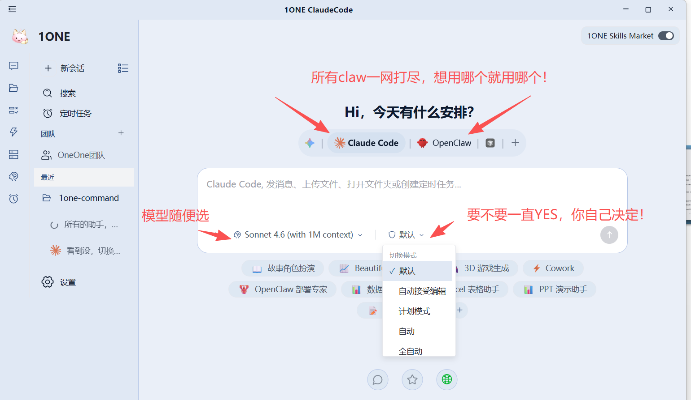
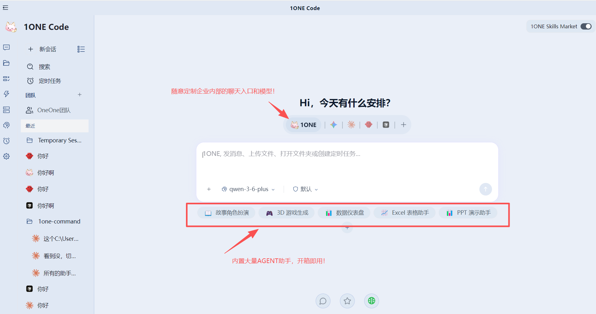
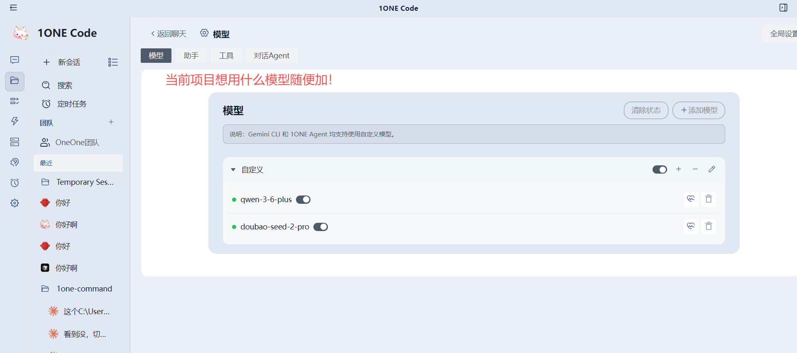
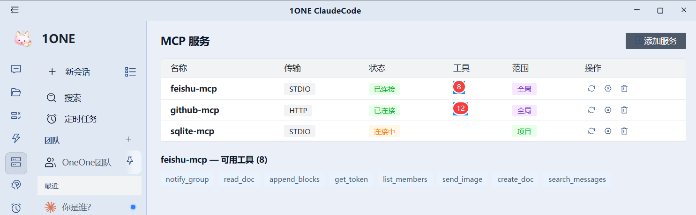
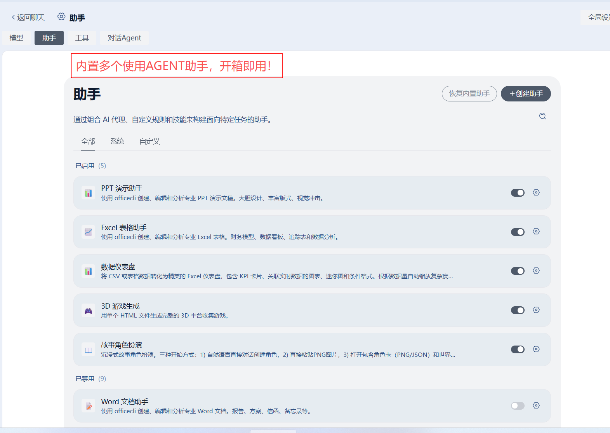
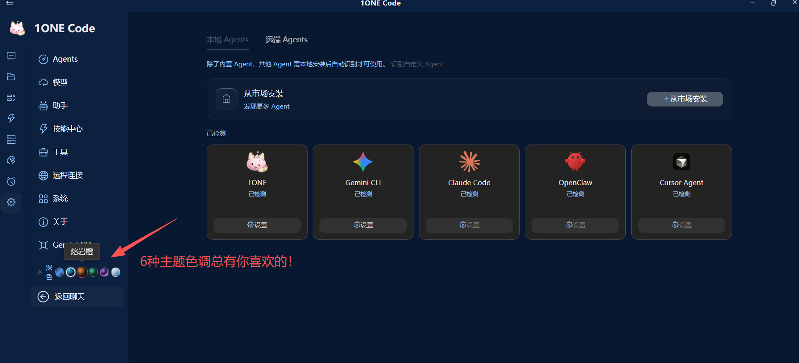

<h1 align="center">1ONE ClaudeCode</h1>

<p align="center">
  <strong>Claude Code 可视化控制面板 · AI Agent 协作指挥台</strong><br>
  <em>免费开源 · 零门槛上手 · 支持任意模型 · 多 Agent 协作 · 远程访问 · 24/7 自动化</em>
</p>

<p align="center">
  
  &nbsp;
  
  &nbsp;
  
  &nbsp;
  
  &nbsp;
  
</p>

<p align="center">
  <a href="https://github.com/gaogg521/1ONE-Claude-Code/releases">
    
  </a>
  &nbsp;&nbsp;
  <a href="./docs/">
    
  </a>
</p>

<div align="center">
  <span style="display:inline-block;width:14px;height:14px;border-radius:4px;background:#22c55e;margin:0 4px;"></span>
  <span style="display:inline-block;width:14px;height:14px;border-radius:4px;background:#06b6d4;margin:0 4px;"></span>
  <span style="display:inline-block;width:14px;height:14px;border-radius:4px;background:#3b82f6;margin:0 4px;"></span>
  <span style="display:inline-block;width:14px;height:14px;border-radius:4px;background:#f59e0b;margin:0 4px;"></span>
  <span style="display:inline-block;width:14px;height:14px;border-radius:4px;background:#ef4444;margin:0 4px;"></span>
  <div style="margin-top:8px;font-size:12px;opacity:.8;">UI 主题强调：清爽高对比 · 绿色开关态 · 统一品牌高亮</div>
</div>

---

<details>
  <summary><strong>📋 目录（点击展开）</strong></summary>

- [为什么用它](#why)
- [快速开始](#quickstart)
  - [下载安装](#install)
  - [macOS 安装步骤（Gatekeeper 放行）](#macos)
  - [第一次使用（3 步上手）](#first-use)
  - [源码运行（开发者）](#dev)
- [功能概览](#features)
- [功能截图](#screenshots)
- [企业版：加入企业与邀请码](#enterprise-join)
- [最近优化（稳定性与体验）](#recent-improvements)
- [配置与数据存储位置](#data-and-config)
- [常见问题（FAQ）](#faq)
- [技术栈](#tech-stack)
- [参与贡献](#contribute)
- [联系作者](#contact)

</details>

---

<a id="why"></a>
## 为什么用它

你可以把它理解成 **Claude Code / 多 Agent 的“可视化控制中心”**：

- **不止一个 Agent**：Claude / OpenClaw / Gemini CLI / Cursor 等按场景切换
- **不止一个模型**：支持任意 OpenAI-compatible / New-API / 自定义端点
- **不止一台设备**：WebUI 远程访问 + 统一设置入口
- **不止一次任务**：定时任务、Hook 监控、记忆中心，适合长期运行

### 一句话，值回票价（甚至不用票价）

**价格优势**：免费开源 + 开箱即用的内置工具/助手，尽量把你从“装环境、配插件、抄脚本、踩坑排障”里解放出来。

你是否也想过：

1. **你想一句话做一个专属于自己的小游戏吗？**
2. **你想一句话写出游戏的故事角色策划吗？**
3. **你想一句话做一份牛逼的 PPT 吗？**
4. **你不会代码，也能写出自己的软件吗？**
5. **你想下班之后还能用微信和飞书管理自己的 AI 吗？**
6. **你想多个人一起合作开发一个工具怎么办？**
7. **Claude Code 的 UI 界面中国人用不了怎么办？**
8. **写代码的人怎么管理自己安装的 N 个开发工具？**

今天老赵（Allen）就来实现你们的愿望：**AI 神器 1ONE Code 来啦**。几十个已经写好的内置工具助手，开箱即用（团队版计划开发中，欢迎赞助！）

<a id="features"></a>
## ✨ 功能概览

| 功能模块 | 说明 |
|---|---|
| 🧭 **统一入口（双视图）** | 一个入口聚合 Agent、模型、任务与扩展配置，支持总览与扩展视图快速切换 |
| 🤖 **多 Agent 管理** | Claude Code、OpenClaw、Gemini CLI、Cursor Agent 等并存管理，按场景灵活切换 |
| 🔧 **模型管理** | 图形化添加任意 API 模型，支持自定义端点、模型名与鉴权配置 |
| 🔌 **MCP 管理与一键接入** | 提供 MCP 状态监控与可视化接入流程，降低配置门槛并提升排障效率 |
| ⚡ **Hook 监控** | 可观测关键生命周期事件，便于构建通知、审计、自动化脚本链路 |
| 🛍️ **技能市场** | 支持按需安装社区技能包，快速扩展 Agent 的专业能力边界 |
| 👤 **自定义助手** | 创建专属助手角色，绑定提示词、技能与默认模型，沉淀团队工作流 |
| 🔎 **历史会话搜索** | 全量历史可检索可回溯，快速定位过往结论与上下文 |
| 🧠 **记忆中心** | 全局与项目记忆统一管理，跨会话保持上下文连续性 |
| 🌐 **远程访问 WebUI** | 支持多设备浏览器访问，便于远程查看与操作任务 |
| 🏢 **企业版（可选）** | 邀请码加入企业、企业后台（用户/LDAP/飞书/SMTP 等）；默认仍为单机 WebUI |
| 💬 **通讯渠道控制** | 可对接 IM 渠道进行消息收发、触发任务与结果回传 |
| ⏰ **定时任务（Cron）** | 按计划自动触发 Agent 流程，满足巡检、日报和批处理场景 |
| 🎨 **主题切换** | 内置多套视觉主题，兼顾品牌表达与长期使用舒适度 |
| 🗂️ **工作空间管理** | 支持按工作空间组织项目和配置，实现多项目隔离协作 |
| 🌍 **开机启动与多语言** | 提供开机自启与多语言界面能力，适配国际化团队与长期运行场景 |

---

<a id="quickstart"></a>
## 🚀 快速开始

<a id="install"></a>
### 下载安装包（推荐）

前往 [Releases 页面](https://github.com/gaogg521/1ONE-Claude-Code/releases) 下载对应系统的安装包：

| 系统 | 文件格式 |
|---|---|
| Windows | `.exe` 安装包 / `.zip` 便携版 |
| macOS | `.dmg` / `.zip`（以 Releases 实际资产为准） |
| Linux | `.deb` 安装包 |

<a id="macos"></a>
### macOS 安装步骤（Gatekeeper 放行）

> 摘自 `out/1OneClaudeCode  Mac安装步骤.docx`，用于解决 macOS 首次打开的系统安全限制提示。

1. **双击安装包**，向右拖动完成安装。
2. 安装完成后，在 **应用程序（Applications）** 里找到 `1OneClaudeCode`，双击运行。
3. 点击完成，先**忽略警告信息**。
4. 打开 **系统设置 → 隐私与安全性**，点击 **仍要打开**（Allow/Open Anyway）。
5. 输入解锁密码后即可成功运行。

<a id="first-use"></a>
### 第一次使用（3 步上手）

1. 打开应用后，点击左侧 **Agents** 选择你要使用的 AI Agent（推荐先用 **1ONE CODE**）
2. 进入左侧 **Models/模型**，添加你的 API Key / Base URL / 模型名
3. 回到 **新会话**，开始与 AI 对话（需要文件就上传/打开工作区）

<a id="dev"></a>
### 源码运行（开发者）

**环境要求：** Node.js >= 22、Git

> **关于 Bun（macOS 常见疑问）**：Bun **不是必须安装**。本项目本地 `postinstall` 会优先使用 `bunx`，若你的机器未安装 Bun，会自动回退到 `npx` 来执行 `electron-builder install-app-deps`，不影响安装依赖与启动。

> **关于 1ONE CODE（aionrs）与离线可用性**：发布版安装包会把 `aionrs` 预置进应用资源（`resources/bundled-aionrs/...`），**最终用户不需要访问 GitHub**。仓库维护者如需在本机重新生成该二进制，可在可联网环境临时设置 `AIONRS_ALLOW_DOWNLOAD=1` 运行 `scripts/prepareAionrs.js`（默认离线模式不会自动下载）。

> **关于 Agent 工具包（CodeGraph / agent-browser）**：正式安装包会把 CLI 预置到 `resources/bundled-agent-toolkit/{平台-架构}/`（打包时自动执行）。运行时 **优先使用包内 CLI**（经 Electron 以 Node 模式启动），**仅当包内缺失时才回退 `npx`**。技能 Markdown（Superpowers、find-skills 等）随应用分发，无需用户单独安装。源码开发若也要本地走包内路径，可在安装依赖后执行一次：`npm run prepare:agent-toolkit`。

```bash
# 克隆项目
git clone https://github.com/gaogg521/1ONE-Claude-Code.git
cd 1ONE-Claude-Code

# 安装依赖
npm install

# ⚠️ 重要：重新编译原生模块（针对 Electron，必须执行）
npx electron-rebuild -f -w better-sqlite3

# 启动开发模式
npm run restart
```

> **黑屏 / `NODE_MODULE_VERSION` 错误**：通常是 `better-sqlite3` 未按 Electron 版本重编译，执行 `npx electron-rebuild -f -w better-sqlite3` 后重启即可。

---

<a id="screenshots"></a>
## 🖼️ 功能截图

### 0. 一句话搞定（价格优势 / 效率优势）

<p align="center">
  
</p>

<p align="center">
  
</p>

<p align="center">
  
</p>

<p align="center">
  
</p>

<p align="center">
  
</p>

<p align="center">
  
</p>

<p align="center">
  
</p>

**图片说明：** 这组截图强调“少折腾/少配置/低成本”的体验：用更少的步骤，把创作、生产与开发任务跑起来。

---

### 1. 统一入口（双图）

<p align="center">
  
</p>

<p align="center">
  
</p>

**图片说明：** 同一功能以双图展示：左图是“统一入口”总览（本地 Claude Code / OpenClaw / Google CLI / Cursor 等一处汇总、开箱即用），右图是扩展视图，突出统一调度与快速切换能力。

---

### 1.1 APP 首页展示

<p align="center">
  
</p>

**图片说明：** 首页聚合常用入口，降低新用户第一次上手的认知成本。

---

### 2. 多 Agent 管理

<p align="center">
  
</p>

**图片说明：** 支持多 Agent 并存与自由启停，可按任务类型选择不同 Agent 协作。

---

### 3. 模型管理

<p align="center">
  
</p>

**图片说明：** 图形化添加与管理模型配置，支持自定义 API 地址、模型名与鉴权信息。

---

### 4. MCP 服务管理（双图）

<p align="center">
  
</p>

<p align="center">
  
</p>

**图片说明：** 同一功能双图展示：左图用于监控服务状态，右图用于演示服务接入流程。

---

### 5. Hook 监控

<p align="center">
  
</p>

**图片说明：** 对关键生命周期 Hook 进行监控，方便追踪自动化流程是否按预期执行。

---

### 6. 技能市场

<p align="center">
  
</p>

**图片说明：** 通过技能市场安装可复用能力模块，快速扩展 Agent 的任务边界。

---

### 7. 自定义助手

<p align="center">
  
</p>

**图片说明：** 支持创建专属助手角色，配置提示词、技能绑定和默认模型。

---

### 7.1 内置大量助手

<p align="center">
  
</p>

**图片说明：** 预置多类工具助手，开箱即用；后续也可按需增删与自定义。

---

### 8. 历史会话搜索

<p align="center">
  
</p>

**图片说明：** 提供会话检索与历史定位能力，可快速回看关键上下文与结论。

---

### 9. 记忆中心

<p align="center">
  
</p>

**图片说明：** 统一管理全局与项目记忆，帮助 Agent 在跨会话场景下保持上下文连续。

---

### 9.1 记忆管理

<p align="center">
  
</p>

**图片说明：** 记忆可视化管理与回溯，更适合长期项目与持续迭代。

---

### 10. 远程访问

<p align="center">
  
</p>

**图片说明：** 支持 WebUI 远程接入，让你在非本机设备上也能查看和操作任务。

<a id="enterprise-join"></a>
### 10.1 企业版：加入企业与邀请码

1ONE 默认是 **单机 WebUI**（本机启用、端口、本地 `admin` 账号与密码）。**企业版**用于多用户与组织治理，二者入口分离，避免混淆：

| 能力 | 入口 | 适用场景 |
|---|---|---|
| **单机 WebUI** | 设置 → **远程连接** → **WebUI** | 个人/单机：开关服务、端口、远程访问、本地管理员密码 |
| **企业后台** | 加入企业且切换到「企业版管理」后 → **企业后台** | 组织：用户/团队、LDAP/飞书登录、系统配置、SMTP、邀请码等 |

#### 加入企业（成员）

1. 打开 **设置 → 远程连接 → WebUI**
2. 在 **「加入企业（可选）」** 面板输入管理员发放的 **邀请码**（支持 `ABCD-EF12` 或 `ABCDEF12` 格式）
3. 点击 **验证邀请码** 确认目标企业名称，再点击 **加入企业**
4. 加入成功后，可在同一页将 **管理模式** 切换为 **企业版管理**，进入企业后台

> **桌面端**：加入/创建企业需先 **启用 WebUI**；完整企业后台请在浏览器打开 WebUI 管理（桌面内仅提供快捷入口）。

> **浏览器 WebUI**：需使用当前已登录的 WebUI 账号加入，加入后会刷新会话上下文。

#### 创建企业（系统管理员）

仅 **尚未加入任何企业** 的 **系统管理员**（`system_admin`）可创建：

1. 在 **加入企业** 面板切换到 **「创建企业」** 标签
2. 填写企业名称并 **创建并加入**
3. 创建者自动成为该企业的 **组织管理员**（`org_admin`），可生成邀请码并管理企业后台

#### 管理邀请码（企业管理员）

1. 加入企业并切换到 **企业版管理**
2. 打开 **企业后台 → 邀请码**
3. 设置 **可用次数**、**有效天数**（可选），点击 **生成邀请码**
4. 将邀请码发给成员；成员在 **远程连接 → WebUI** 中输入即可加入
5. 可随时 **作废** 未使用的邀请码

#### 常见问题（企业版）

- **加入失败：邀请码无效/过期/已作废/已达上限** → 联系管理员重新发放
- **加入失败：当前账号已加入企业** → 一个账号同一时间只能属于一个企业租户
- **看不到「企业后台」菜单** → 需先加入企业，并把管理模式切到「企业版管理」（浏览器 WebUI；桌面端请用浏览器打开）
- **桌面端为什么没有完整企业后台？** → 企业治理功能在 WebUI 浏览器中提供，桌面端专注本机会话与 Agent 使用

---

### 11. 通讯渠道控制

<p align="center">
  
</p>

**图片说明：** 支持将外部 IM 渠道接入工作流，实现消息通知、触发任务与结果回传。

---

### 12. 定时任务

<p align="center">
  
</p>

**图片说明：** 使用 Cron 计划任务让 Agent 自动执行固定流程，适合巡检与日报场景。

---

### 12.1 团队任务（协作）

<p align="center">
  
</p>

**图片说明：** 多人协作场景下，把任务与产出结构化管理（团队版能力在规划中）。

---

### 13. 主题切换

<p align="center">
  
</p>

**图片说明：** 内置多套 UI 主题，可按偏好切换视觉风格并提升长时间使用体验。

---

### 14. 工作空间

<p align="center">
  
</p>

**图片说明：** 提供工作空间维度的组织与隔离能力，便于多项目并行管理。

---

### 15. 开机启动和多语言

<p align="center">
  
</p>

**图片说明：** 支持开机自启与多语言切换，满足跨地区团队和持续运行需求。

---

### 16. 一键添加各种使用 MCP

<p align="center">
  
</p>

**图片说明：** 在统一流程中完成能力接入与配置联动，减少跨页面来回切换。

---

<a id="recent-improvements"></a>
## ✅ 最近优化（稳定性与体验）

下面这些是近期已经落地的体验优化（确保“开箱即用”，并减少新用户疑惑）：

- **设置默认打开 Agents**：进入设置后默认落到本地 Agents 页面，而不是 Gemini CLI。
- **新用户工作区空态更友好**：在 Workspace Hub 提供可执行的引导（去创建会话 / 项目设置）。
- **Agents 支持启用/禁用开关**：禁用的本地 Agent 不会出现在“新建会话”的 Agent 选择框里。
- **内置助手与源码同步**：源码删掉的内置助手，会自动从用户配置中清理，避免“幽灵助手”。
- **全局 Switch 开启态为绿色**：统一视觉语义（开启=绿色，减少误读）。
- **设置页切换更顺**：避免一次性挂载全部 Tab 内容，并在空闲时预加载常用设置页，降低首切卡顿。
- **Agent 工具包开箱即用**：内置 CodeGraph MCP、Superpowers/find-skills 技能与 agent-browser；CodeGraph/agent-browser CLI **默认走安装包内资源**，找不到再 `npx`。
- **WebUI 与企业后台分离**：远程连接 → WebUI 管单机；加入企业后可切企业版管理（用户/LDAP/飞书/邀请码等）。
- **企业加入向导**：邀请码加入、系统管理员创建企业、企业后台生成/作废邀请码。

---

<a id="data-and-config"></a>
## 📦 配置与数据存储位置

以下路径用于排查问题/备份数据（不同系统路径会略有差异）：

- **数据库（会话/消息/团队）**：`%APPDATA%\1OneClaudeCode-Dev\1one\1one.db`
- **配置（模型/MCP/Agents 等）**：`%APPDATA%\1OneClaudeCode-Dev\config\one-config.txt`（base64 编码 JSON）
- **开发模式锁文件**：`%APPDATA%\1OneClaudeCode-Dev\lockfile`

> 如果你启动后发现窗口/实例异常，优先用 `npm run restart`（它会清理 lockfile 并重启）。

---

<a id="faq"></a>
## ❓ 常见问题（FAQ）

**1）为什么设置页打开很早时，本地 Agents 可能短暂为空？**  
本地 Agent 识别是异步完成的，通常稍等片刻会自动出现；如果你刚启动就立刻打开设置，可能会看到短暂空列表。

**2）为什么我禁用了某个 Agent 后，新建会话里看不到它？**  
这是预期行为：禁用=不参与“新建会话”的候选列表，你可以随时在设置里重新开启。

**3）开发模式启动报 `NODE_MODULE_VERSION` / SQLite 相关错误？**  
执行一次：

```bash
npx electron-rebuild -f -w better-sqlite3
```

然后用：

```bash
npm run restart
```

**4）如何在浏览器远程访问 WebUI？**  
在桌面端 **设置 → 远程连接 → WebUI** 启用服务后，用页面上的 **访问地址** 打开（未开「允许远程访问」时为 `http://localhost:端口`；开启后为本机局域网 IP）。开发模式默认端口 **25809**，正式安装包为 **25808**——这是本机 WebUI 服务端口，不是「跳转到别的系统」。登录页正确地址为 `http://localhost:端口/#/login`（若出现 `/login#/login` 请更新到最新版）。也可单独运行 `npm run webui:prod`。

**5）CodeGraph MCP 需要我自己 `npx` 安装吗？**  
不需要（正式安装包）。应用会在 `设置 → 工具 → Agent 工具包` 中默认启用 CodeGraph MCP，并优先启动包内的 `codegraph` CLI。仅当包内资源缺失（例如源码开发未执行 `npm run prepare:agent-toolkit`）时才会回退到 `npx -y @colbymchenry/codegraph`。

**6）单机 WebUI 和企业后台有什么区别？**  
**WebUI**（设置 → 远程连接）只管本机：启用服务、端口、远程访问、本地 `admin` 密码。**企业后台**在加入企业并切换到「企业版管理」后出现，用于组织级用户、LDAP/飞书、SMTP、邀请码等。详见上文 [企业版：加入企业与邀请码](#enterprise-join)。

**7）如何用邀请码加入企业？**  
管理员在 **企业后台 → 邀请码** 生成代码；成员在 **设置 → 远程连接 → WebUI → 加入企业** 中验证并加入。桌面端需先启用 WebUI；完整企业后台请在浏览器打开 WebUI。

---

<a id="tech-stack"></a>
## 🛠️ 技术栈

| 层级 | 技术 |
|---|---|
| **桌面壳** | Electron 37 |
| **前端框架** | React 19.1 + TypeScript（strict） |
| **构建工具** | Vite 6 + electron-vite |
| **UI 组件** | Arco Design + UnoCSS |
| **终端集成** | node-pty + xterm.js |
| **本地存储** | SQLite (better-sqlite3) |
| **运行时** | Node.js（桌面端）；Bun（用于 CI/部分脚本与调试工具） |
| **协议支持** | MCP (Model Context Protocol) |

---

<a id="contribute"></a>
## 🤝 参与贡献

欢迎提交 Issue 和 Pull Request！

- 🐛 **Bug 反馈**：[提交 Issue](https://github.com/gaogg521/1ONE-Claude-Code/issues)
- 💡 **功能建议**：[发起讨论](https://github.com/gaogg521/1ONE-Claude-Code/discussions)
- 📖 **版本发布**：[Releases](https://github.com/gaogg521/1ONE-Claude-Code/releases)

---

<a id="contact"></a>
## 📬 联系作者

有问题、想交流、或者想一起共建？欢迎通过以下方式联系：

<table align="center">
  <tr>
    <td align="center" width="300">
      <strong>💬 QQ 技术交流群</strong><br>
      <sub>oneclaw技术交流群 · 群号：2159069958</sub><br>
      <sub>欢迎进群交流产品使用、插件能力和自动化实践</sub>
      <br><br>
      
    </td>
    <td align="center" width="50"></td>
    <td align="center" width="300">
      <strong>💚 微信</strong><br>
      <sub>Allen.赵 · 上海浦东</sub><br>
      <sub>可用于问题反馈、合作与生态共建沟通</sub>
      <br><br>
      
    </td>
  </tr>
</table>

---

<p align="center">
  <sub>Built by <a href="https://github.com/gaogg521">gaogg521</a> · Licensed under MIT</sub>
</p>
