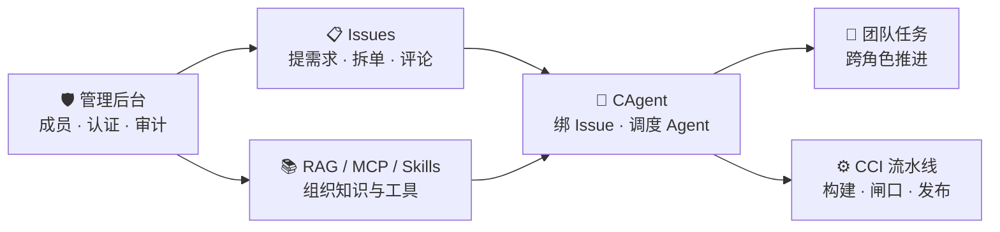
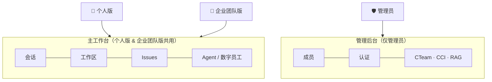
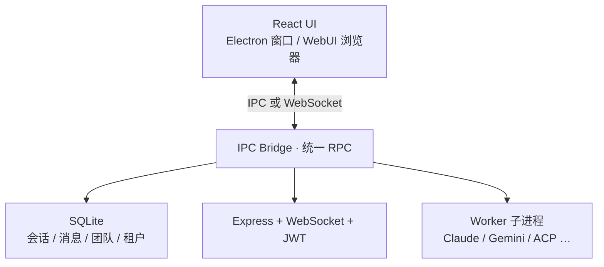

<h1 align="center">1ONE ClaudeCode</h1>

<p align="center">
  
</p>

<p align="center">
  <strong>全球少有的「开源 · 多 Agent · 可远程 · 可协同 · 可私有化」AI 操作系统</strong><br>
  <em>不是 Claude Code 换皮，不是 Cursor 平替 —— 一个人用是创作引擎，一个团队用是交付平台</em>
</p>

<p align="center">
  
  &nbsp;
  
  &nbsp;
  
  &nbsp;
  
  &nbsp;
  
</p>

<p align="center">
  <a href="https://github.com/gaogg521/1ONE-Claude-Code/releases">
    
  </a>
  &nbsp;&nbsp;
  <a href="./docs/">
    
  </a>
</p>

---

<a id="highlights"></a>

## 🔥 六张王牌：为什么 1ONE 不是「又一个 AI 聊天工具」

市面上大多数产品只做一件事：**在 IDE 里补全代码**，或 **绑死单一 Claude Agent 聊天**。

1ONE ClaudeCode 从第一天就不同 —— 它是一套 **Agent 操作系统**，把「个人创作 → 团队协作 → 组织治理 → 自动交付」串进同一个产品：

| # | 独特点 | 你得到什么 | 竞品通常做不到 |
|---|--------|------------|----------------|
| 1 | **多 Agent 原生指挥台** | Claude Code、Codex、Gemini、OpenClaw、Cursor Agent… **一个界面统管**，MCP/Skills 配一次全员复用 | 多数只支持单一 Agent 或 IDE 插件式接入 |
| 2 | **WebUI 远程 + IM 触达** | 桌面、浏览器、手机、飞书/钉钉/微信 **同一套 Agent**；下班也能管 AI | Cursor / Copilot / 原生 Claude Code **无独立 WebUI** |
| 3 | **个人版 & 企业团队版同 UI** | 标题栏一键切身份，**界面不换**，数据按租户隔离 | 商业产品个人版与企业版往往是两套系统 |
| 4 | **数字员工可交付** | 配置 Cron、绑定 Issue、产出 HTML/Word/飞书文档，**能跑、能交活** | 聊天工具只给文本，不管交付物 |
| 5 | **内置 DevOps 平台** | Issues → Agent → **CTeam / CCI 流水线 / 制品库 / 效能洞察**，不是外挂 | IDE 助手不涉及需求协同与 CI/CD |
| 6 | **开源免费 + 私有化** | MIT 协议、Docker/内网部署、**数据不出域**，国内团队可直接落地 | 闭源 SaaS 按人头 $10–40/月收费 |

> **一句话**：Cursor 帮你写下一行代码；Copilot 帮你补全一个函数；**1ONE 帮你管一整支 AI 队伍，并把产出写进团队的交付流程。**

---

<a id="comparison"></a>

## ⚔️ 一张表打穿：1ONE vs Cursor vs Copilot vs 原生 Claude Code

| 对比维度 | **1ONE ClaudeCode** | Cursor | GitHub Copilot | 原生 Claude Code |
|----------|:-------------------:|:------:|:--------------:|:----------------:|
| **产品性质** | ✅ 开源免费 | 🔒 闭源 | 🔒 闭源 | 🔒 闭源 |
| **多 Agent 并存** | ✅ 原生 | ⚠️ 有限 | ⚠️ 弱 | ❌ 单一 |
| **独立 WebUI 远程** | ✅ 桌面+浏览器+手机 | ❌ | ❌ | ❌ |
| **IM 渠道（飞书/钉钉/微信）** | ✅ | ❌ | ❌ | ❌ |
| **数字员工 + Cron 自动化** | ✅ | ❌ | ❌ | ⚠️ 有限 |
| **Issues 需求协同** | ✅ 内置 | ❌ | ❌ | ❌ |
| **企业团队版（同 UI 切身份）** | ✅ 免费内置 | 💰 Business | 💰 Enterprise | ⚠️ 弱 |
| **组织治理（LDAP/飞书/邀请码）** | ✅ 管理后台 | ❌ | ⚠️ 企业版 | ❌ |
| **DevOps（CTeam/CCI/制品库）** | ✅ 内置平台 | ❌ | ❌ | ❌ |
| **私有化 / 内网部署** | ✅ Docker/WebUI | ❌ | ⚠️ 企业可选 | ⚠️ 大客户定制 |
| **国内团队可用** | ✅ 数据本地 | ⚠️ 受限 | ✅ | ❌ 难访问 |
| **月费** | ✅ **$0** | 💰 $20–40 | 💰 $10–19 | 💰 $20+ |

<p align="center">
  
</p>
<p align="center"><sub>一个入口，统管 Agent、协同、DevOps —— 不是同质化聊天窗口</sub></p>

---

<details open>
  <summary><strong>📋 目录</strong></summary>

- [六张王牌：产品独特点](#highlights)
- [竞争优势对比](#comparison)
- [个人版：一个人，一支 AI 军团](#personal-edition)
- [企业团队版：把 AI 写进交付流程](#team-edition)
- [管理后台：组织治理 + DevOps 不另购 SaaS](#admin-platform)
- [企业协作闭环一览](#team-loop)
- [双版本怎么选？一张对照表](#editions-compare)
- [底层架构长什么样](#architecture)
- [功能截图 Gallery](#screenshots)
- [3 分钟上手](#quickstart)
- [企业接入指南](#enterprise)
- [FAQ](#tech)

</details>

---

<a id="personal-edition"></a>

## 🧑‍💻 个人版：一个人，就是一支 AI 军团

**给谁用：** 开发者、创作者、独立使用者 —— **无需加入任何企业**，安装即用。

**核心体验：** 把 N 个 CLI Agent、N 个模型、N 个助手，收进 **一个可视化指挥台**；不用装一堆工具、抄配置脚本、在终端和网页之间来回跳。

### 个人版能做什么

| 能力 | 亮点 |
|------|------|
| **多 Agent 统管** | Claude Code / Codex / Gemini / OpenClaw / Cursor Agent 等 **自动发现、一键切换** |
| **内置专业助手** | PPT、游戏、文档、开发等 **数十个助手开箱即用**，也可自定义角色 |
| **任意模型接入** | OpenAI-compatible、New-API、Ollama… **图形化配 Key，不绑单一厂商** |
| **MCP 一键接入** | 外部工具 **配一次、所有 Agent 共享**；内置 CodeGraph 等工具包 |
| **Skills 技能市场** | 按需安装社区技能，扩展 Agent 专业边界 |
| **记忆中心** | 全局 + 项目记忆，**跨会话不断档** |
| **定时任务 Cron** | 24/7 自动跑 Agent：日报、巡检、批处理 **无人值守** |
| **WebUI 远程** | 浏览器 / 手机访问本机 Agent，**人在外面也能盯任务** |
| **IM 渠道** | 飞书 / 钉钉 / 微信 **发消息就能触发 AI**，结果自动回传 |
| **个人 Issues** | 启用 WebUI 后，**个人需求看板**与 Agent 助手联动 |
| **数字员工** | 创建个人智能体，支持 **立即运行 + Cron + 文档交付**（HTML/Word/飞书） |
| **Hook 监控** | Agent 生命周期事件可观测，方便挂通知和审计 |

### 个人版典型场景

- 🎮 **一句话做游戏 / PPT / 文档** —— 不会代码也能产出可交付文件
- 💻 **多 Agent 并行写代码** —— Claude 写后端、Codex 写测试，同一界面切换
- 📱 **手机远程盯 Agent** —— WebUI 打开就能看进度、收结果
- ⏰ **定时日报/巡检** —— Cron 绑定数字员工，每天自动跑

<p align="center">
  
</p>
<p align="center"><sub>个人版：多 Agent 自由搭配，按任务选最合适的引擎</sub></p>

<p align="center">
  
</p>
<p align="center"><sub>个人数字员工：选 Agent、绑技能、设定时、配置文档交付模板</sub></p>

<p align="center">
  
</p>
<p align="center"><sub>个人创作：一句话驱动 Agent 产出可运行成果</sub></p>

---

<a id="team-edition"></a>

## 🏢 企业团队版：把 AI 协作写进交付流程

**给谁用：** 已加入企业租户的成员 —— 用 **公司身份** 做协同，界面与个人版 **完全相同**，只换身份与数据边界。

**核心体验：** 不是另买一套协作软件。PM 提 Issue、研发用 Agent 处理、测试看流水线、管理员管资源 —— **全在一个产品里闭环**。

### 企业团队版 = 个人版全部能力 + 团队协作层

| 能力 | 团队版独有什么 |
|------|----------------|
| **企业身份登录** | LDAP / 飞书 SSO / 企业账号，**租户级数据隔离** |
| **敏捷 Issues** | 需求看板、**AI 智能拆单**、协作评论，侧栏与工作区入口一致 |
| **CAgent 智能助手** | Issue 绑定 → 调度 Agent → 查看运行结果 → **一键进入协作调度** |
| **团队任务 & 共享会话** | 主工作台按 **团队 scope** 协同，不用切到别的系统 |
| **团队页 / 多 Agent 协同** | 企业团队版专属 **「团队（企业团队版）」** 侧栏入口 |
| **数字员工（团队）** | 团队级数字员工，组织统一下发技能与运行策略 |
| **Skills 组织下发** | 管理员维护技能包，**成员 Agent 开箱即用同一套能力** |
| **团队 RAG 知识库** | 企业文档上传、向量检索，**Agent 回答带组织知识** |
| **团队 MCP** | 组织级工具代理，**凭证集中管理、权限可控** |
| **团队代码库 / 运行时** | 代码资产与 Agent 运行时纳入 **企业租户边界** |
| **CTeam / CCI（按角色）** | 规划看板、流水线编排与执行，**从需求直达交付** |

> **关键设计：** 标题栏切「企业团队版」**不会**打开管理后台；日常协作留在工作台，管组织才去后台。

<p align="center">
  
</p>
<p align="center"><sub>企业团队版：同一工作台，公司身份下的 Issues、Agent 与协同</sub></p>

<p align="center">
  
</p>
<p align="center"><sub>CAgent：企业知识 + 工具连接 + 交付流程，围绕 Issue 调度 AI</sub></p>

<p align="center">
  
</p>
<p align="center"><sub>Issues 协同：状态、拆单结果、协作评论一屏掌握</sub></p>

<p align="center">
  
</p>
<p align="center"><sub>团队任务：跨角色看板，与个人任务分层而不分裂</sub></p>

<p align="center">
  
</p>
<p align="center"><sub>组织统一 Skills，一键下发到每位成员的 Agent</sub></p>

<p align="center">
  
</p>
<p align="center"><sub>工作区「企业协同与平台能力」：Issues / CAgent / 管理后台 / CCI 一键直达</sub></p>

---

<a id="team-loop"></a>

## 🔄 从提需求到自动交付：团队协作闭环


```mermaid
flowchart LR
  A["📋 Issues<br/>提需求 · 拆单 · 评论"]
  B["🤖 CAgent<br/>绑 Issue · 调度 Agent"]
  C["👥 团队任务<br/>跨角色推进"]
  D["📚 RAG / MCP / Skills<br/>组织知识与工具"]
  E["⚙️ CCI 流水线<br/>构建 · 闸口 · 发布"]
  F["🛡️ 管理后台<br/>成员 · 认证 · 审计"]

  A --> B --> C
  D --> B
  B --> E
  F --> D
  F --> A
```

<p align="center">
  
</p>
<p align="center"><sub>Issue 详情：评论、关联任务、跳转 Agent 处理 —— 需求与 AI 执行不断链</sub></p>

<p align="center">
  
</p>
<p align="center"><sub>企业代码资产接入，关联 Agent 工作区与交付链路</sub></p>

---

<a id="admin-platform"></a>

## 🛡️ 管理后台：组织治理 + DevOps，不另购 SaaS

**给谁用：** 组织管理员（`org_admin` / 系统管理员）—— **不是**日常聊天界面。

**核心体验：** 成员、LDAP/飞书、邀请码、RAG/MCP/Skills 治理、CTeam、CCI 流水线… 商业 DevOps+AI 平台卖的能力，**1ONE 开源内置**。

| 模块 | 管理员能做什么 |
|------|----------------|
| **成员 & 团队** | 用户、角色、组织架构、团队运行时 |
| **企业认证** | LDAP、飞书 / 钉钉 / 企微 SSO、SMTP |
| **邀请码** | 生成 / 作废，成员 **自助加入企业** |
| **CTeam 规划看板** | 需求泳道、版本规划 |
| **CCI 流水线** | 编排、执行、质量闸口 |
| **CPack / CCode** | 制品库、代码资产 |
| **CMeas 效能洞察** | DORA 指标、交付分析 |
| **组织 RAG / MCP / Skills** | 统一配置、审计、下发 |

<p align="center">
  
</p>
<p align="center"><sub>组织管理后台：成员、LDAP、飞书、邀请码、邮箱治理</sub></p>

<p align="center">
  
</p>
<p align="center"><sub>DevOps 平台：CTeam · CCI · CPack · CCode · CMeas 一站式</sub></p>

<p align="center">
  
</p>
<p align="center"><sub>企业 SSO 登录：本地账号 / LDAP / 飞书</sub></p>

<p align="center">
  
</p>
<p align="center"><sub>系统管理员：创建企业、发邀请码、多租户治理</sub></p>

---

<a id="editions-compare"></a>

## 🎯 双版本怎么选？个人版 vs 企业团队版 vs 管理后台

| | **个人版** | **企业团队版** | **管理后台** |
|---|:---:|:---:|:---:|
| **谁用** | 任何人 | 已加入企业的成员 | 组织管理员 |
| **界面** | 主工作台 | **同一套**主工作台 | 独立企业控制台 |
| **登录** | 本机 / 本地 WebUI | 企业账号 / LDAP / 飞书 | 管理员账号 |
| **多 Agent & 助手** | ✅ | ✅ | — |
| **数字员工 & Cron** | ✅ 个人 scope | ✅ 个人 + 团队 scope | — |
| **个人 Issues** | ✅ | ✅ | — |
| **团队 Issues / 任务 / 共享会话** | — | ✅ | — |
| **团队页 / 组织 RAG / MCP 下发** | — | ✅ | 配置 |
| **CTeam / CCI / 制品库** | — | 按角色 | ✅ |
| **从哪进** | 标题栏 → 个人版 | 标题栏 → 企业团队版 | 侧栏「管理后台」 |


```mermaid
flowchart TB
  subgraph Workbench["主工作台（个人版 & 企业团队版共用）"]
    S["会话"] --- W["工作区"] --- I["Issues"] --- A["Agent / 数字员工"]
  end
  subgraph Admin["管理后台（仅管理员）"]
    U["成员"] --- Auth["认证"] --- DevOps["CTeam · CCI · RAG"]
  end
  Personal["🧑 个人版"] --> Workbench
  Enterprise["🏢 企业团队版"] --> Workbench
  OrgAdmin["🛡️ 管理员"] --> Admin
```

> 切换个人版 ↔ 企业团队版 **只换身份，不换界面**；**管公司**去管理后台，不是切版本。

---

<a id="architecture"></a>

## 🏗️ 底层架构：为什么能同时跑桌面、WebUI 和企业租户


```mermaid
flowchart TB
  UI["React UI<br/>Electron 窗口 / WebUI 浏览器"]
  Bridge["IPC Bridge · 统一 RPC"]
  DB["SQLite<br/>会话 / 消息 / 团队 / 租户"]
  WS["Express + WebSocket + JWT"]
  Workers["Worker 子进程<br/>Claude / Gemini / ACP …"]

  UI <-->|IPC 或 WebSocket| Bridge
  Bridge --> DB & WS & Workers
```

| 进程 | 职责 |
|------|------|
| **Main** | 数据库、Bridge、WebUI 服务、Cron |
| **Renderer** | React UI（桌面与浏览器共用） |
| **Worker** | 各 Agent 隔离子进程，互不影响 |

- WebUI 与桌面 **复用同一套 Bridge** —— 不是两套代码
- 企业 API 按 **租户 scope** 隔离 —— 个人数据不会混入组织池
- 身份通过 `IdentitySnapshot` + `EditionGate` 统一管控

规格：[`docs/product/edition-and-identity-spec.md`](./docs/product/edition-and-identity-spec.md) · [`docs/product/cagent-vs-1one-architecture.md`](./docs/product/cagent-vs-1one-architecture.md)

| 运行模式 | 命令 |
|----------|------|
| 桌面开发 | `npm run restart` |
| WebUI | `npm run webui:prod` |
| LAN 远程 | `npm run build:webui` 后访问 IP |
| 服务器 | [`docs/SERVER_DEPLOY_GUIDE.md`](./docs/SERVER_DEPLOY_GUIDE.md) |

---

<a id="screenshots"></a>

## 📸 功能截图 Gallery

> 全宽单图展示，便于查看细节。

### 🌐 WebUI 远程：Agent 不绑在工位上

<p align="center">
  
</p>
<p align="center"><sub>浏览器打开即完整 UI —— 团队协作不必每人装桌面端</sub></p>

<p align="center">
  
</p>
<p align="center"><sub>手机 / 平板 / 同事电脑：远程监管 Agent 运行</sub></p>

<p align="center">
  
</p>
<p align="center"><sub>端口、远程开关、企业加入、本地管理员</sub></p>

### 🤖 模型 & 助手：不绑单一厂商

<p align="center">
  
</p>
<p align="center"><sub>任意 API 端点图形化配置</sub></p>

<p align="center">
  
</p>
<p align="center"><sub>对话中随时换模型</sub></p>

<p align="center">
  
</p>
<p align="center"><sub>数十个专业助手，个人与团队复用</sub></p>

<p align="center">
  
</p>
<p align="center"><sub>自定义助手：提示词 + 技能 + 默认模型</sub></p>

<p align="center">
  
</p>
<p align="center"><sub>工具助手：封装工作流，降低 Prompt 门槛</sub></p>

### 🔌 MCP · Skills · Hook · 记忆

<p align="center">
  
</p>
<p align="center"><sub>MCP 注册与启停</sub></p>

<p align="center">
  
</p>
<p align="center"><sub>运行监控与排障</sub></p>

<p align="center">
  
</p>
<p align="center"><sub>一键接入；组织管理员可在后台统一配团队 MCP</sub></p>

<p align="center">
  
</p>
<p align="center"><sub>技能市场</sub></p>

<p align="center">
  
</p>
<p align="center"><sub>技能仓库</sub></p>

<p align="center">
  
</p>
<p align="center"><sub>Hook 生命周期监控</sub></p>

<p align="center">
  
</p>
<p align="center"><sub>记忆中心</sub></p>

<p align="center">
  
</p>
<p align="center"><sub>记忆可视化管理</sub></p>

### ⏰ 自动化 & IM：AI 24 小时在线

<p align="center">
  
</p>
<p align="center"><sub>全量会话检索</sub></p>

<p align="center">
  
</p>
<p align="center"><sub>工作区分组 · 团队会话标识</sub></p>

<p align="center">
  
</p>
<p align="center"><sub>Cron 调度数字员工</sub></p>

<p align="center">
  
</p>
<p align="center"><sub>绑定会话 · 执行历史 · 启停</sub></p>

<p align="center">
  
</p>
<p align="center"><sub>飞书 / 钉钉 / 微信触发 Agent 并回传</sub></p>

### ✨ 一句话创作：看见 Agent 的交付力

<p align="center">
  
</p>

<p align="center">
  
</p>

<p align="center">
  
</p>
<p align="center"><sub>一句话出 PPT</sub></p>

<p align="center">
  
</p>
<p align="center"><sub>故事 · 角色 · 策划</sub></p>

<p align="center">
  
</p>

<p align="center">
  
</p>
<p align="center"><sub>一句话驱动开发任务</sub></p>

### ⚙️ 全局设置

<p align="center">
  
</p>
<p align="center"><sub>Agent · 模型 · WebUI · 主题</sub></p>

<p align="center">
  
</p>
<p align="center"><sub>开机自启 · 多语言</sub></p>

---

<a id="quickstart"></a>

## 🚀 3 分钟上手

### 下载

[Releases](https://github.com/gaogg521/1ONE-Claude-Code/releases) → Windows `.exe` / macOS `.dmg` / Linux `.deb`

### 路线 A：个人用户

1. **会话** → 选 Agent（推荐 1ONE CODE）
2. **设置 → 模型** → 填 API Key
3. 开聊；有项目就绑 **工作区**

### 路线 B：团队 / 企业

1. **设置 → WebUI** → 启用服务
2. **邀请码** 加入企业 → 标题栏切 **企业团队版**
3. **Issues / Agent 助手** 开始协同；管理员进 **管理后台**

### 开发者

```bash
git clone https://github.com/gaogg521/1ONE-Claude-Code.git && cd 1ONE-Claude-Code
npm install && npx electron-rebuild -f -w better-sqlite3 && npm run restart
```

---

<a id="enterprise"></a>

## 🏛️ 企业接入指南

| | 入口 | 用途 |
|---|------|------|
| 单机 WebUI | 设置 → 远程连接 → WebUI | 端口、远程、本地 admin |
| 企业控制台 | `/#/enterprise` | 成员、认证、DevOps |

**成员：** 邀请码加入 → 切企业团队版 → 用 Issues / 数字员工 / 团队任务

**管理员：** 创建企业 → 发邀请码 → 配 LDAP/飞书 → 开 CTeam/CCI/RAG

文档：[`edition-personal-vs-enterprise.md`](./docs/product/edition-personal-vs-enterprise.md) · [`WEBUI_GUIDE.md`](./docs/WEBUI_GUIDE.md)

---

<a id="tech"></a>

## ❓ FAQ & 技术栈

| 层级 | 技术 |
|------|------|
| 桌面 | Electron 37 + React 19 + TypeScript |
| UI | Arco Design + UnoCSS |
| 存储 | SQLite + ConfigStorage |
| 后端 | Express + WebSocket + JWT + MCP |

<details>
<summary><strong>个人版和企业团队版界面一样吗？</strong></summary>
一样。差别在<strong>身份、租户数据、团队能力开关</strong>。
</details>

<details>
<summary><strong>和 Cursor / Copilot 什么关系？</strong></summary>
1ONE 是<strong>指挥台</strong>：可挂载 Cursor Agent、Claude Code CLI 等，并统一管理协同与 DevOps；不替代 IDE，而是 orchestrate 整支 AI 队伍。
</details>

<details>
<summary><strong>LAN 访问 WebUI 样式异常？</strong></summary>
执行 <code>npm run build:webui</code> 后 Ctrl+F5 强刷。
</details>

架构：[`docs/tech/architecture.md`](./docs/tech/architecture.md)

---

## 🤝 参与贡献

[Issue](https://github.com/gaogg521/1ONE-Claude-Code/issues) · [Discussion](https://github.com/gaogg521/1ONE-Claude-Code/discussions) · [Releases](https://github.com/gaogg521/1ONE-Claude-Code/releases)

<p align="center">
  <sub>Built by <a href="https://github.com/gaogg521">gaogg521</a> · MIT License</sub>
</p>
