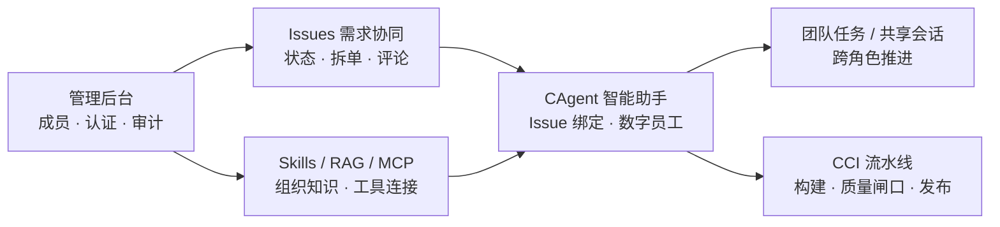
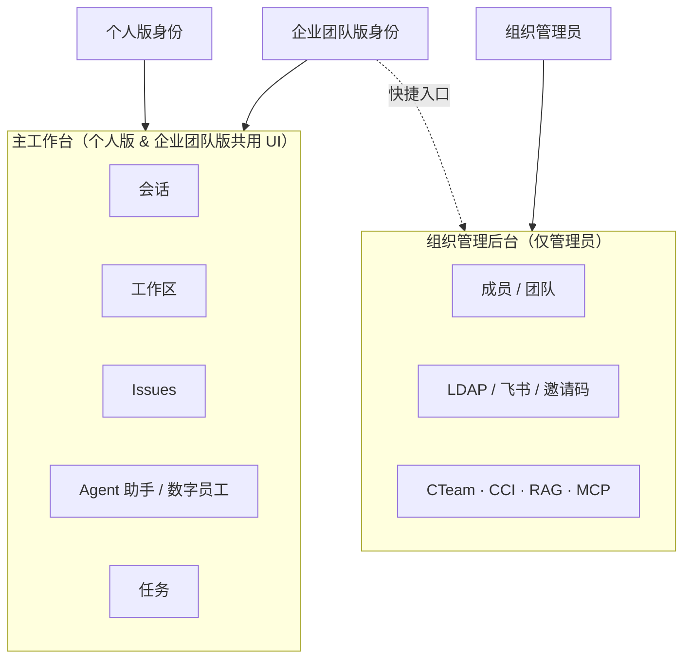
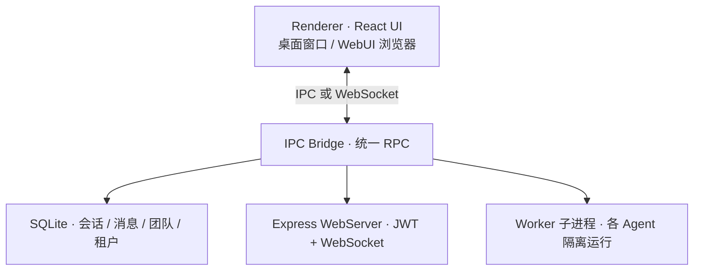

<h1 align="center">1ONE ClaudeCode</h1>

<p align="center">
  
</p>

<p align="center">
  <strong>开源免费的 AI Agent 指挥台 —— 个人创作 · 企业团队协同 · 组织治理 · DevOps 平台</strong><br>
  <em>不止 Claude Code 可视化壳：从单人工作台，升级为可私有化部署的团队级 AI 操作系统</em>
</p>

<p align="center">
  
  &nbsp;
  
  &nbsp;
  
  &nbsp;
  
  &nbsp;
  
</p>

<p align="center">
  <a href="https://github.com/gaogg521/1ONE-Claude-Code/releases">
    
  </a>
  &nbsp;&nbsp;
  <a href="./docs/">
    
  </a>
</p>

<p align="center">
  
</p>
<p align="center"><sub>统一入口：个人会话、企业协同、Agent 助手、DevOps 能力，一处汇聚</sub></p>

---

<details open>
  <summary><strong>📋 目录</strong></summary>

- [为什么升级：企业团队版是核心](#why-enterprise)
- [企业团队协作闭环](#team-loop)
- [组织管理后台与 DevOps 平台](#admin-platform)
- [竞争优势对比](#comparison)
- [三大入口：个人 / 企业团队 / 管理后台](#editions)
- [系统架构](#architecture)
- [个人版能力概览](#personal)
- [功能截图](#screenshots)
- [快速开始](#quickstart)
- [企业版接入指南](#enterprise)
- [技术栈与 FAQ](#tech)

</details>

---

<a id="why-enterprise"></a>

## 为什么升级：企业团队版是核心

早期 1ONE 解决的是 **「个人如何把 Claude Code / Codex / Gemini 用起来」**。

**当前版本完成架构级跃迁**：在**同一套 UI** 上叠加 **企业身份、租户隔离、团队协作、组织治理、DevOps 平台**——个人版继续免费可用，团队与企业能力原生内置，无需另购商业 SaaS。

| | 个人版 | **企业团队版** | 组织管理后台 |
|---|--------|----------------|--------------|
| **谁用** | 开发者、创作者 | 已加入企业的成员 | 组织管理员 |
| **界面** | 会话 / 工作区 / Agent | **同一套界面**，切换企业身份 | 独立企业控制台 |
| **协同** | 个人 Issues、本地 Agent | **团队 Issues、团队任务、共享会话、数字员工** | — |
| **组织资源** | 本地 Skills / MCP / 记忆 | **组织 RAG、团队 MCP、技能下发** | 统一配置与审计 |
| **DevOps** | — | 按角色使用 CTeam / CCI 等 | **流水线、制品库、效能洞察** |
| **认证** | 本机 / 本地 WebUI | **LDAP / 飞书 SSO / 企业账号** | 邀请码、成员、权限 |

> **关键设计**：切换「个人版 ↔ 企业团队版」**不换界面**，只换身份与数据边界；**管组织**走管理后台，不是切版本。

<p align="center">
  
</p>
<p align="center"><sub>企业团队版：同一工作台，以公司身份做 Issues、团队协同与 Agent 调度</sub></p>

---

<a id="team-loop"></a>

## 企业团队协作闭环

从「提需求」到「AI 交付」到「组织治理」，1ONE 把整条链路串在同一产品里：


```mermaid
flowchart LR
  A["Issues 需求协同<br/>状态 · 拆单 · 评论"]
  B["CAgent 智能助手<br/>Issue 绑定 · 数字员工"]
  C["团队任务 / 共享会话<br/>跨角色推进"]
  D["Skills / RAG / MCP<br/>组织知识 · 工具连接"]
  E["CCI 流水线<br/>构建 · 质量闸口 · 发布"]
  F["管理后台<br/>成员 · 认证 · 审计"]

  A --> B --> C
  D --> B
  B --> E
  F --> D
  F --> A
```

### 企业团队版能做什么

| 能力 | 说明 |
|------|------|
| **敏捷 Issues** | 产品需求看板、AI 智能拆单、协作评论；与侧栏 Issues 同一工作台 |
| **CAgent 智能助手** | 把 Issue、企业知识、MCP 工具、交付流程串成受控 AI 工作台 |
| **数字员工 / Agent 舰队** | 个人与企业团队数字员工；支持立即运行、Cron 定时、文档/HTML/Word/飞书交付 |
| **团队任务 & 共享会话** | 主工作台内按团队 scope 协同，不必切换独立系统 |
| **团队 Skills 下发** | 组织统一技能包，成员 Agent 开箱即用 |
| **团队知识库 RAG** | 文档上传、切片、向量检索，支撑企业问答与 Agent 上下文 |
| **团队 MCP** | 组织级外部工具代理，凭证集中管理 |
| **团队代码库 / 运行时** | 代码资产与 Agent 运行时纳入企业租户边界 |

<p align="center">
  
</p>
<p align="center"><sub>CAgent：围绕 Issue 调度 Agent、查看运行结果、管理数字员工</sub></p>

<p align="center">
  
</p>
<p align="center"><sub>Issues 协同：需求状态、拆解结果与协作上下文一屏可见</sub></p>

<p align="center">
  
</p>
<p align="center"><sub>Issue 详情：评论、关联任务、跳转 Agent 处理</sub></p>

<p align="center">
  
</p>
<p align="center"><sub>团队任务：跨角色看板，与个人任务在同一产品内分层管理</sub></p>

<p align="center">
  
</p>
<p align="center"><sub>数字员工：配置 Agent 类型、技能、Cron、文档交付模板，个人版与企业版均可使用</sub></p>

<p align="center">
  
</p>
<p align="center"><sub>组织管理员统一维护 Skills，一键下发到团队成员</sub></p>

<p align="center">
  
</p>
<p align="center"><sub>企业代码资产接入，关联交付链路与 Agent 工作区</sub></p>

---

<a id="admin-platform"></a>

## 组织管理后台与 DevOps 平台

管理后台面向 **组织管理员**，负责「管人、管认证、管资源、管流水线」——与日常聊天的企业团队版工作区**分离**，避免权限与体验混淆。

<p align="center">
  
</p>
<p align="center"><sub>组织管理后台：成员、LDAP、飞书、邀请码、邮箱等企业治理入口</sub></p>

<p align="center">
  
</p>
<p align="center"><sub>DevOps 平台能力预览：CTeam、CCI、CPack、CCode、CMeas 等模块</sub></p>

| 模块 | 能力 |
|------|------|
| **成员 & 团队** | 用户、角色、组织架构、团队运行时 |
| **企业认证** | LDAP、飞书 / 钉钉 / 企微 SSO、SMTP 邮件 |
| **邀请码** | 成员自助加入企业，租户隔离 |
| **CTeam 规划看板** | 需求泳道、版本规划、跨角色推进 |
| **CCI 流水线** | 编排、执行、质量闸口 |
| **CPack 制品库** | 制品存储与分发 |
| **CCode 代码库** | 代码资产与交付关联 |
| **CMeas 效能洞察** | DORA 指标、交付效能分析 |
| **团队 RAG / MCP / Skills** | 组织级 AI 资源统一配置 |

<p align="center">
  
</p>
<p align="center"><sub>WebUI 企业登录：支持本地账号、LDAP、飞书等企业 SSO</sub></p>

<p align="center">
  
</p>
<p align="center"><sub>系统管理员：创建企业、发放邀请码、治理多租户实例</sub></p>

工作区页提供 **「企业协同与平台能力」** 快捷入口：已加入企业的用户可从主工作台一键进入 Issues、CAgent、管理后台、CCI 流水线，无需先找独立菜单。

---

<a id="comparison"></a>

## 竞争优势对比

| 对比维度 | **1ONE ClaudeCode** | Cursor | GitHub Copilot | 原生 Claude Code |
|----------|---------------------|--------|----------------|------------------|
| **产品性质** | ✅ 开源免费 | 🔒 商业闭源 | 🔒 商业闭源 | 🔒 商业闭源 |
| **多 Agent** | ✅ Claude / Codex / Gemini / OpenClaw 等原生并存 | ⚠️ 有限 | ⚠️ 较弱 | ❌ 单一 Agent |
| **团队协作** | ✅ **企业团队版内置**（Issues / 任务 / 数字员工 / 组织资源） | 💰 Business 付费 | 💰 Enterprise 付费 | ⚠️ 协作有限 |
| **组织治理** | ✅ 管理后台（LDAP / 飞书 / 邀请码 / 审计） | ❌ | ⚠️ 企业版 | ❌ |
| **DevOps 平台** | ✅ CTeam / CCI / CPack / CMeas 等 | ❌ | ❌ | ❌ |
| **WebUI 远程** | ✅ 桌面 + 浏览器 + LAN / 服务器 | ❌ | ❌ | ❌ |
| **私有化部署** | ✅ Docker / 本机 WebUI / 内网 | ❌ | ⚠️ 企业可选 | ⚠️ 大客户定制 |
| **国内可用** | ✅ 团队内网部署，数据不出域 | ⚠️ 部分受限 | ✅ | ❌ 访问困难 |
| **定价** | ✅ **完全免费** | 💰 $20–40/人/月 | 💰 $10–19/人/月 | 💰 $20+/月 |

**和 Cursor / Copilot 的本质差异**：它们卖的是 IDE 内的补全或聊天；1ONE 卖的是 **可自托管、可协同、可治理、可自动化** 的 Agent 操作系统——个人用得上，团队也撑得住。

---

<a id="editions"></a>

## 三大入口：个人 / 企业团队 / 管理后台


```mermaid
flowchart TB
  subgraph Workbench["主工作台（个人版 & 企业团队版共用 UI）"]
    S["会话"]
    W["工作区"]
    I["Issues"]
    A["Agent 助手 / 数字员工"]
    T["任务"]
  end

  subgraph Admin["组织管理后台（仅管理员）"]
    U["成员 / 团队"]
    Auth["LDAP / 飞书 / 邀请码"]
    DevOps["CTeam · CCI · RAG · MCP"]
  end

  Personal["个人版身份"] --> Workbench
  Enterprise["企业团队版身份"] --> Workbench
  OrgAdmin["组织管理员"] --> Admin
  Enterprise -.->|"快捷入口"| Admin
```

| 入口 | 做什么 | 从哪进 |
|------|--------|--------|
| **个人版** | 本机身份：聊天、创作、个人 Issues、本地 Agent | 标题栏 → **个人版** |
| **企业团队版** | 公司身份：**同一界面**下的 Issues、团队任务、数字员工、共享协同 | 标题栏 → **企业团队版** |
| **管理后台** | 管成员、认证、组织资源、CCI 流水线 | 侧栏 **管理后台** / 工作区 **企业协同与平台能力** |

---

<a id="architecture"></a>

## 系统架构

### 多进程 + 统一 Bridge


```mermaid
flowchart TB
  UI["Renderer · React UI<br/>桌面窗口 / WebUI 浏览器"]
  Bridge["IPC Bridge · 统一 RPC"]
  DB["SQLite · 会话 / 消息 / 团队 / 租户"]
  WS["Express WebServer · JWT + WebSocket"]
  Workers["Worker 子进程 · 各 Agent 隔离运行"]

  UI <-->|IPC 或 WebSocket| Bridge
  Bridge --> DB
  Bridge --> WS
  Bridge --> Workers
```

- **Main**（`src/process/`）：数据库、Bridge、WebUI 服务
- **Renderer**（`src/renderer/`）：React UI
- **Worker**（`src/process/worker/`）：Claude / Gemini / ACP 等独立子进程

WebUI 与桌面 **复用同一套 Bridge 处理器**；企业 API 按 **租户 scope** 隔离数据。

### 身份与能力矩阵

| 能力域 | 个人版 | 企业团队版 | 管理后台 |
|--------|--------|------------|----------|
| 会话 / 工作区 / 本地 Agent | ✅ | ✅ | — |
| Issues / 团队任务 / 数字员工 | ✅ 个人 scope | ✅ 团队 scope | — |
| 共享会话 / 团队协同 | — | ✅ | — |
| LDAP / 飞书 / 邀请码 | — | 使用 | ✅ 配置 |
| 组织 RAG / MCP / Skills | 本地 | 团队 + 组织 | ✅ |
| CCI / CTeam / 制品库 | — | 按角色 | ✅ |

规格文档：[`docs/product/edition-and-identity-spec.md`](./docs/product/edition-and-identity-spec.md) · [`docs/product/cagent-vs-1one-architecture.md`](./docs/product/cagent-vs-1one-architecture.md)

### 运行模式

| 模式 | 命令 | 说明 |
|------|------|------|
| 桌面开发 | `npm run restart` | Electron + HMR |
| WebUI | `npm run webui:prod` | 浏览器访问（25809 开发 / 25808 安装包） |
| 远程 LAN | `npm run build:webui` 后访问 LAN IP | 需预构建 `out/renderer/` |
| 服务器 | 见 [`docs/SERVER_DEPLOY_GUIDE.md`](./docs/SERVER_DEPLOY_GUIDE.md) | Docker / 无界面部署 |

---

<a id="personal"></a>

## 个人版能力概览

个人版仍是完整可用的 AI 工作台，与企业团队版**共用界面**，未加入企业时即可使用：

| 模块 | 说明 |
|------|------|
| **多 Agent** | Claude Code、Codex、Gemini、OpenClaw、Cursor Agent 等 |
| **内置助手** | 数十个开箱即用助手（PPT、游戏、开发、文档等） |
| **模型管理** | 任意 OpenAI-compatible / New-API 端点 |
| **MCP / Skills / Hook** | 工具接入、技能市场、生命周期监控 |
| **记忆中心** | 全局与项目记忆，跨会话连续 |
| **定时任务** | Cron 24/7 自动执行 Agent |
| **WebUI 远程** | 浏览器 / 手机访问本机 Agent |
| **通讯渠道** | 飞书、钉钉、微信等 IM 触发与回传 |
| **个人 Issues** | 需求看板（WebUI 启用后） |

---

<a id="screenshots"></a>

## 功能截图

> 以下截图均为**全宽单图**展示。企业团队版相关截图已排在前列。

### 企业团队 & 管理后台

<p align="center">
  
</p>
<p align="center"><sub>工作区：已加入企业后，展示「企业协同与平台能力」快捷卡片</sub></p>

### WebUI 与远程访问

<p align="center">
  
</p>
<p align="center"><sub>WebUI：浏览器访问同一套 UI，支持 LAN / 服务器部署，团队协作无需每人装桌面端</sub></p>

<p align="center">
  
</p>
<p align="center"><sub>远程访问：手机、平板、同事电脑通过浏览器监管 Agent 运行</sub></p>

<p align="center">
  
</p>
<p align="center"><sub>WebUI 设置：端口、远程开关、企业加入、本地管理员</sub></p>

### 多 Agent 与模型

<p align="center">
  
</p>
<p align="center"><sub>多 Agent 并存：按任务切换 Claude / Codex / Gemini / OpenClaw 等</sub></p>

<p align="center">
  
</p>
<p align="center"><sub>模型管理：图形化配置 API Key、Base URL、模型名</sub></p>

<p align="center">
  
</p>
<p align="center"><sub>会话内随时切换模型，无需重启对话</sub></p>

### 助手与内置能力

<p align="center">
  
</p>
<p align="center"><sub>内置大量专业助手，个人与团队均可复用</sub></p>

<p align="center">
  
</p>
<p align="center"><sub>自定义助手：绑定提示词、技能与默认模型</sub></p>

<p align="center">
  
</p>
<p align="center"><sub>工具助手：封装常用工作流，降低 Prompt 门槛</sub></p>

### MCP · Skills · Hook · 记忆

<p align="center">
  
</p>
<p align="center"><sub>MCP 服务总览：注册、启停、状态监控</sub></p>

<p align="center">
  
</p>
<p align="center"><sub>MCP 运行监控：排障与自动化联动</sub></p>

<p align="center">
  
</p>
<p align="center"><sub>一键接入常用 MCP，组织管理员也可在后台统一配置团队 MCP</sub></p>

<p align="center">
  
</p>
<p align="center"><sub>技能市场：扩展 Agent 专业能力边界</sub></p>

<p align="center">
  
</p>
<p align="center"><sub>技能仓库：本地与组织技能统一管理</sub></p>

<p align="center">
  
</p>
<p align="center"><sub>Hook 监控：Agent 生命周期事件可观测</sub></p>

<p align="center">
  
</p>
<p align="center"><sub>记忆中心：跨会话保持项目上下文</sub></p>

<p align="center">
  
</p>
<p align="center"><sub>记忆管理：可视化管理长期项目记忆</sub></p>

### 会话、定时任务与通讯渠道

<p align="center">
  
</p>
<p align="center"><sub>历史会话搜索：团队与个人会话均可检索回溯</sub></p>

<p align="center">
  
</p>
<p align="center"><sub>会话时间线：工作区分组、团队会话标识</sub></p>

<p align="center">
  
</p>
<p align="center"><sub>定时任务：Cron 调度数字员工与 Agent 流程</sub></p>

<p align="center">
  
</p>
<p align="center"><sub>任务详情：绑定会话、执行历史、启停控制</sub></p>

<p align="center">
  
</p>
<p align="center"><sub>通讯渠道：飞书 / 钉钉 / 微信等 IM 触发 Agent 并回传结果</sub></p>

### 一句话创作（效率演示）

<p align="center">
  
</p>
<p align="center"><sub>一句话生成可运行的小游戏</sub></p>

<p align="center">
  
</p>

<p align="center">
  
</p>

<p align="center">
  
</p>
<p align="center"><sub>一句话生成专业 PPT</sub></p>

<p align="center">
  
</p>
<p align="center"><sub>一句话完成故事、角色与策划创作</sub></p>

<p align="center">
  
</p>

<p align="center">
  
</p>
<p align="center"><sub>一句话驱动 Agent 完成开发任务</sub></p>

### 全局设置

<p align="center">
  
</p>
<p align="center"><sub>全局设置：Agent、模型、WebUI、主题等统一入口</sub></p>

<p align="center">
  
</p>
<p align="center"><sub>开机自启与多语言，适配团队长期运行与国际化</sub></p>

---

<a id="quickstart"></a>

## 快速开始

### 下载安装

前往 [Releases](https://github.com/gaogg521/1ONE-Claude-Code/releases)：

| 系统 | 格式 |
|------|------|
| Windows | `.exe` / `.zip` |
| macOS | `.dmg` / `.zip` |
| Linux | `.deb` |

### 个人用户（3 步）

1. 侧栏 **会话** → 选择 Agent（推荐 **1ONE CODE**）
2. **设置 → 模型** → 配置 API Key
3. 开始对话；有项目时绑定 **工作区**

### 团队 / 企业用户（3 步）

1. **设置 → 远程连接 → WebUI** → 启用服务
2. 输入管理员 **邀请码** 加入企业 → 标题栏切 **企业团队版**
3. 从 **工作区** 或侧栏进入 **Issues / Agent 助手**；管理员另开 **管理后台**

### 源码运行

```bash
git clone https://github.com/gaogg521/1ONE-Claude-Code.git
cd 1ONE-Claude-Code
npm install
npx electron-rebuild -f -w better-sqlite3
npm run restart
```

| 命令 | 用途 |
|------|------|
| `npm run restart` | 开发模式（已有实例时优先） |
| `npm run restart:webui` | 构建 + WebUI 模式 |
| `npm run build:webui` | LAN 浏览器访问前必须构建 |
| `npm run test` | 单元测试 |

---

<a id="enterprise"></a>

## 企业版接入指南

### 单机 WebUI vs 企业控制台

| | 入口 | 用途 |
|---|------|------|
| **单机 WebUI** | 设置 → 远程连接 → WebUI | 本机端口、远程访问、本地 admin |
| **企业控制台** | `/#/enterprise` | 成员、认证、邀请码、DevOps 模块 |

### 成员加入

1. WebUI → **加入企业** → 输入邀请码 → 加入
2. 标题栏切换 **企业团队版**
3. 使用 Issues、团队任务、数字员工、共享协同

### 管理员初始化

1. 系统管理员 **创建企业** → 成为 `org_admin`
2. **邀请码** 分发给成员
3. **企业认证** 配置 LDAP / 飞书 / SMTP
4. **CTeam / CCI / RAG / MCP** 按需开启组织模块

> 桌面端：日常协作在桌面或 WebUI 工作台；完整组织治理推荐 **浏览器打开 WebUI 企业后台**。

文档：[`docs/product/edition-personal-vs-enterprise.md`](./docs/product/edition-personal-vs-enterprise.md) · [`docs/WEBUI_GUIDE.md`](./docs/WEBUI_GUIDE.md) · [`docs/SERVER_DEPLOY_GUIDE.md`](./docs/SERVER_DEPLOY_GUIDE.md)

---

<a id="tech"></a>

## 技术栈与 FAQ

### 技术栈

| 层级 | 技术 |
|------|------|
| 桌面壳 | Electron 37 |
| 前端 | React 19 + TypeScript |
| 构建 | Vite 6 + electron-vite |
| UI | Arco Design + UnoCSS |
| 存储 | SQLite + ConfigStorage |
| 协议 | MCP |
| 后端 | Express + WebSocket + JWT |

### 数据路径（Windows）

| 数据 | 路径 |
|------|------|
| 数据库 | `%APPDATA%\1OneClaudeCode-Dev\1one\1one.db` |
| 配置 | `%APPDATA%\1OneClaudeCode-Dev\config\one-config.txt` |

架构详情：[`docs/tech/architecture.md`](./docs/tech/architecture.md)

### 常见问题

<details>
<summary><strong>个人版和企业团队版界面一样吗？</strong></summary>
一样。差别在<strong>身份与租户数据</strong>，以及企业团队版才开放的团队协作（团队 scope、共享会话、组织资源等）。
</details>

<details>
<summary><strong>管理和聊天要分开吗？</strong></summary>
要。日常协作用<strong>企业团队版工作区</strong>；管成员、认证、流水线用<strong>管理后台</strong>。切版本不会自动进后台。
</details>

<details>
<summary><strong>LAN 访问 WebUI 样式异常？</strong></summary>
非 localhost 走预构建产物。修改 renderer 后执行 <code>npm run build:webui</code> 并 Ctrl+F5。
</details>

<details>
<summary><strong>和 Cursor / Copilot 什么关系？</strong></summary>
1ONE 是<strong>指挥台</strong>：可挂载 Cursor Agent、Claude Code CLI 等，并统一管理模型、MCP、企业协同与 DevOps；不替代 IDE，而是 orchestrate 多个 AI 工具与团队流程。
</details>

---

## 参与贡献

- 🐛 [提交 Issue](https://github.com/gaogg521/1ONE-Claude-Code/issues)
- 💡 [发起讨论](https://github.com/gaogg521/1ONE-Claude-Code/discussions)
- 📖 [版本发布](https://github.com/gaogg521/1ONE-Claude-Code/releases)

规范：[`AGENTS.md`](./AGENTS.md)

---

<p align="center">
  <sub>Built by <a href="https://github.com/gaogg521">gaogg521</a> · Licensed under MIT</sub>
</p>
